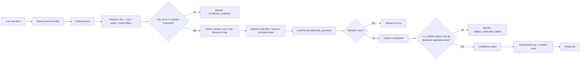

# AI System Specification

| Field | Value |
|---|---|
| **Version** | 1.0.0-draft |
| **Status** | Proposed - no AI code, prompts, models or evaluation datasets exist |
| **Last updated** | 2026-09-14 |
| **Related** | [PRD.md](PRD.md) §15.2 · [SECURITY_RESPONSIBLE_AI.md](SECURITY_RESPONSIBLE_AI.md) · [DATA_MODEL.md](DATA_MODEL.md) §9 · [API_INTEGRATION_SPEC.md](API_INTEGRATION_SPEC.md) · [TECH_STACK.md](TECH_STACK.md) §9–10 · [TESTING_STRATEGY.md](TESTING_STRATEGY.md) · [OBSERVABILITY_SPEC.md](OBSERVABILITY_SPEC.md) |

> **Scope of AI in MVP.** The AI layer is limited to four uses:
> 1. grounded document Q&A;
> 2. MCQ candidate generation;
> 3. MCQ validation (answer-key and support checks);
> 4. embeddings for retrieval and near-duplicate detection.
>
> Competency scoring, gap detection, recommendations and learning paths are **deterministic** in MVP (PRD-AI-005). The tutor, adaptive assessment and free-text evaluation are P1.

## Table of contents

1. [AI provider abstraction](#1-ai-provider-abstraction)
2. [Embedding provider abstraction](#2-embedding-provider-abstraction)
3. [Prompt management](#3-prompt-management)
4. [Prompt versioning](#4-prompt-versioning)
5. [Model configuration](#5-model-configuration)
6. [Token and cost controls](#6-token-and-cost-controls)
7. [Retry behavior](#7-retry-behavior)
8. [Timeout behavior](#8-timeout-behavior)
9. [Structured output validation](#9-structured-output-validation)
10. [JSON schema validation](#10-json-schema-validation)
11. [RAG architecture](#11-rag-architecture)
12. [Chunking strategy](#12-chunking-strategy)
13. [Metadata strategy](#13-metadata-strategy)
14. [Retrieval strategy](#14-retrieval-strategy)
15. [Reranking strategy](#15-reranking-strategy)
16. [Citation generation](#16-citation-generation)
17. [Citation verification](#17-citation-verification)
18. [Hallucination mitigation](#18-hallucination-mitigation)
19. [Abstention behavior](#19-abstention-behavior)
20. [Confidence scoring](#20-confidence-scoring)
21. [MCQ generation](#21-mcq-generation)
22. [MCQ validation](#22-mcq-validation)
23. [Duplicate detection](#23-duplicate-detection)
24. [Answer evaluation](#24-answer-evaluation)
25. [Competency estimation](#25-competency-estimation)
26. [Recommendation logic](#26-recommendation-logic)
27. [Personalization logic](#27-personalization-logic)
28. [Adaptive assessment logic](#28-adaptive-assessment-logic)
29. [AI tutor behavior](#29-ai-tutor-behavior)
30. [Human-review workflow](#30-human-review-workflow)
31. [AI evaluation framework](#31-ai-evaluation-framework)
32. [Golden datasets](#32-golden-datasets)
33. [Offline evaluation](#33-offline-evaluation)
34. [Online evaluation](#34-online-evaluation)
35. [Bias and fairness checks](#35-bias-and-fairness-checks)
36. [Prompt-injection defense](#36-prompt-injection-defense)
37. [Malicious-document handling](#37-malicious-document-handling)
38. [Sensitive-information handling](#38-sensitive-information-handling)
39. [AI audit logs](#39-ai-audit-logs)
40. [Model fallback strategy](#40-model-fallback-strategy)
41. [Required metadata on AI artefacts](#41-required-metadata-on-ai-artefacts)
42. [AI capability to responsible-AI control matrix](#42-ai-capability-to-responsible-ai-control-matrix)

---

## 1. AI provider abstraction

All LLM access goes through `LLMProvider` in `backend/app/modules/ai/providers/`. No other module imports a provider SDK (PRD-AI-001).

```text
LLMProvider (interface)
  capabilities() -> ProviderCapabilities
      supports_structured_output: bool
      supports_native_citations: bool
      supports_streaming: bool
      max_context_tokens: int
      max_output_tokens: int
  generate(request: LLMRequest) -> LLMResult
  generate_structured(request: LLMRequest, output_schema: JSONSchema) -> StructuredResult
  generate_grounded(request: LLMRequest, sources: list[SourceBlock]) -> GroundedResult
      # uses native citations if supported, else schema-based citations (§16)

LLMRequest:  purpose, prompt_template_version_id, system_text, messages,
             max_output_tokens, timeout_s, provider_options (e.g. effort),
             correlation_id, organization_id, user_id (for logging only; never sent)
LLMResult:   text | parsed, native_citations[], stop_reason (end, max_tokens, refusal, error),
             refusal_category, usage{input_tokens, output_tokens, cache_read_tokens},
             model_id, latency_ms, provider_request_id
SourceBlock: chunk_id, document_title, page_start, page_end, text
```

| Implementation | Status | Use |
|---|---|---|
| `FakeLLMProvider` | Planned | Deterministic responses for tests, CI and local demos; no data egress |
| `AnthropicProvider` | Planned, candidate (DEC-005) | Uses the official Anthropic Python SDK. Structured outputs via `output_config.format` / `messages.parse()`; native citations with `citations: {enabled: true}` on document blocks |
| Other providers (commercial or self-hosted) | Candidates | Implement the same interface and pass the provider contract tests |

**Provider contract tests** ([TESTING_STRATEGY.md](TESTING_STRATEGY.md)) verify that every implementation:
- maps refusals, timeouts and rate limits to the common result and error types;
- respects `max_output_tokens`;
- never logs secrets.

## 2. Embedding provider abstraction

```text
EmbeddingProvider (interface)
  model_id: str
  dimension: int
  normalized: bool
  max_batch_size: int
  embed_documents(texts: list[str]) -> list[Vector]
  embed_query(text: str) -> Vector
```

| Implementation | Status | Use |
|---|---|---|
| `FakeEmbeddingProvider` | Planned | Deterministic hash-based vectors for tests |
| Selected provider | Decision required (DEC-006) | Chosen by retrieval evaluation on the collected corpus (§31) |

Rules:
- Every stored vector records `model_id` and `dimension` ([DATA_MODEL.md](DATA_MODEL.md) §13).
- Vectors from different models are never compared.
- Query and document embeddings must come from the same model.

## 3. Prompt management

- Prompts are text files under `backend/app/modules/ai/prompts/<key>/<version>/` (`system.md`, `user.md`, `output_schema.json`, `model_config.json`, `CHANGELOG.md`). They are imported into the registry tables (`PromptTemplate`, `PromptTemplateVersion`).
- **Services load prompts only from the registry by key and active version.** Inline prompt strings in service code are prohibited (enforced by a lint check).
- **Template variables are limited to named slots** (e.g. `{{sources}}`, `{{question}}`, `{{parameters}}`). User text and document text are inserted only into designated untrusted-data slots, wrapped in delimiters (§36).
- **MVP prompt keys:**

| Key | Purpose | Output |
|---|---|---|
| `document_qa` | Grounded answer with citations | Native citations or `qa_answer.schema.json` |
| `mcq_generation` | Candidate MCQs from source chunks | `mcq_candidates.schema.json` |
| `mcq_key_validation` | Independent answer from source, without the key | `mcq_key_check.schema.json` |
| `mcq_support_validation` | Whether the evidence span supports the keyed answer | `mcq_support_check.schema.json` |

## 4. Prompt versioning

- **Versions are immutable** (`key` + `vN`) and carry a `content_hash` over system text, user template, output schema and model configuration.
- **Any change creates a new version,** including model ID, output limits or provider options.
- **Lifecycle:** `draft` → `active` → `retired`. Only one version per key is active.
- **Activation requires a passing `EvaluationRun`** for that exact version (RAI-012). Activation is done by `platform_admin` with re-authentication, and it is audited.
- **Every AI artefact records its `prompt_template_version_id`** (§41).

## 5. Model configuration

Model settings live in `PromptTemplateVersion.model_config`, so a model change is a prompt-version change.

```json
{
  "provider": "anthropic | fake | <other>",
  "model": "<provider model id>",
  "max_output_tokens": 4000,
  "timeout_s": 60,
  "max_retries": 2,
  "provider_options": { "effort": "high" }
}
```

- **Candidate defaults if Anthropic is selected** (DEC-005). All values are illustrative until evaluated.
  - `claude-opus-5` for `mcq_generation`, `mcq_key_validation`, `mcq_support_validation` and `document_qa`.
  - Cheaper tiers (`claude-sonnet-5`, `claude-haiku-4-5`) only where offline evaluation shows equivalent quality. Tier changes for cost are a recorded product decision, not an engineering default.
- **Provider-specific parameters are capability-driven.** Current Claude models (e.g. Opus 5) reject classic sampling parameters such as `temperature`, and control depth through `effort` instead. The interface therefore does not assume `temperature` exists.
- **Environment variables** select provider credentials only (`LLM_API_KEY`, etc.). They never override a registered model configuration silently.

## 6. Token and cost controls

| Control | Rule |
|---|---|
| Input budget per purpose | `document_qa`: at most N retrieved chunks (initial N=8) and a hard input token cap; `mcq_generation`: at most M chunks per candidate batch (initial M=4) |
| Output cap | `max_output_tokens` per prompt version; truncated outputs (`stop_reason=max_tokens`) are treated as invalid, not partially used |
| Questions per job | Initial cap of 20 candidates per generation job (provisional) |
| Per-user limits | Rate limit on `document_qa` (initial: configurable requests per minute and per day) |
| Per-organisation quota | Daily token or cost budget per purpose; exceeding it disables the purpose with an explicit message until reset or admin increase |
| Cost estimation | `AIInteractionLog.cost_estimate` from usage and a configured price table (maintained by the platform admin; not hard-coded) |
| Alerts | Budget threshold alerts ([OBSERVABILITY_SPEC.md](OBSERVABILITY_SPEC.md)) |
| Caching | Stable system prompts placed first to benefit from provider prompt caching where supported; effectiveness verified through `cache_read` usage metrics, never assumed |
| Batching | Generation and validation jobs may use provider batch APIs (P1 optimisation) only if latency allows and data policy permits |

All initial numbers are **provisional**. They are tuned after baseline measurement and recorded as prompt or setting versions.

## 7. Retry behavior

| Error class | Retry? | Policy |
|---|---|---|
| Connection error, 408, 409, 429, 5xx | Yes | Exponential backoff with jitter; honour `Retry-After`; `max_retries` from model config (default 2) |
| 400 (invalid request), 401/403 (auth), 404 | No | Log and fail; alert on auth errors |
| `stop_reason = refusal` | No (same input) | Map to abstention `safety_refusal` (§19); fallback only per §40 |
| `stop_reason = max_tokens` | One retry allowed for generation jobs with the same input only if the version defines a larger cap; otherwise invalid | — |
| Schema-invalid structured output | One regeneration attempt, then discard | Count as `invalid_output` |

- **SDK retries and application retries are not stacked blindly.** The adapter configures the SDK's retry count explicitly (the Anthropic SDK defaults to 2 retries) and does not add an outer retry loop for the same error classes.
- **Background jobs** have their own job-level retry policy (AUT-013) for failures after adapter retries are exhausted.

## 8. Timeout behavior

| Purpose | Mode | Timeout (initial, provisional) | On timeout |
|---|---|---|---|
| `document_qa` | Interactive; streaming allowed | 60 s total request budget | Error state with retry action; logged `timeout` |
| `mcq_generation` | Background job | Per-call timeout sized to `max_output_tokens`; use streaming for long outputs | Job retry, then failed |
| Validators | Background job | Per-call 60 s | `validation_incomplete` |
| Embeddings | Background job | Per-batch 60 s | Job retry |

- **Timeouts are set explicitly** on every call. SDK defaults (the Anthropic Python SDK's default is 10 minutes) are not relied upon.
- **Wall-clock budgets account for retries:** `timeout × (retries + 1)` must fit within the request or job budget.

## 9. Structured output validation

1. **Provider-native structured output** is used where supported. For Claude this is `output_config.format` with a JSON Schema, or `messages.parse()` in the Python SDK.
2. **The backend always re-validates**, whatever the provider guarantees. It validates with Pydantic models generated from the same schema.
3. **Semantic validation** follows (e.g. exactly one correct option, evidence span present) in the validators of §22.
4. **Failures** are logged with `validation_status=failed` and never displayed or persisted as valid artefacts.

## 10. JSON schema validation

- **Location:** Each prompt version's `output_schema.json` is JSON Schema (draft 2020-12) with `additionalProperties: false` and explicit `required`.
- **Consistency:** A CI check ensures the Pydantic model and the stored schema agree (round-trip test).
- **Example: MCQ candidate schema (abbreviated)**

```json
{
  "type": "object", "additionalProperties": false, "required": ["candidates"],
  "properties": {
    "candidates": {
      "type": "array", "maxItems": 20,
      "items": {
        "type": "object", "additionalProperties": false,
        "required": ["stem", "options", "correct_label", "explanation", "difficulty", "evidence"],
        "properties": {
          "stem": {"type": "string", "minLength": 10, "maxLength": 600},
          "options": {"type": "array", "minItems": 4, "maxItems": 4,
            "items": {"type": "object", "additionalProperties": false, "required": ["label", "text"],
              "properties": {"label": {"enum": ["A","B","C","D"]}, "text": {"type": "string", "minLength": 1, "maxLength": 300}}}},
          "correct_label": {"enum": ["A","B","C","D"]},
          "explanation": {"type": "string", "minLength": 20, "maxLength": 1000},
          "difficulty": {"enum": ["foundational","intermediate","advanced"]},
          "evidence": {"type": "array", "minItems": 1, "maxItems": 3,
            "items": {"type": "object", "additionalProperties": false, "required": ["chunk_id", "quote"],
              "properties": {"chunk_id": {"type": "string"}, "quote": {"type": "string", "minLength": 10, "maxLength": 500}}}}
        }
      }
    }
  }
}
```

## 11. RAG architecture



**Invariants**
- No displayed factual segment lacks a verified citation.
- Every response path, including abstentions and errors, writes an `AIInteractionLog` row before returning.

## 12. Chunking strategy

| Parameter | Initial value (provisional) | Rationale |
|---|---|---|
| Unit | Normalised page text → paragraphs → sentences | Preserves page mapping for citations |
| Target size | 400–800 tokens | Balances precision and context for methodology prose |
| Overlap | ~10–15% of target, at sentence boundaries | Avoids splitting definitions |
| Boundaries | Never across documents; may cross a page boundary only within one chunk, recording `page_start`/`page_end` | Page-level citations |
| Headings | Nearest heading text stored as chunk metadata (when detectable) | Retrieval context |
| Tables | Extracted text as-is (no table structure in MVP) | Limitation documented |
| Versioning | `chunker_version` (e.g. `chunk-v1`) | Deterministic re-chunking |

Parameters are tuned by retrieval evaluation (§31). Changing them creates a new chunker version and a re-chunk and re-embed job.

## 13. Metadata strategy

Metadata stored on or derivable for each chunk:

| Metadata | Source | Use |
|---|---|---|
| `organization_id`, `learning_material_id`, `document_id`, `version_number` | Content model | ACL filtering, citation |
| `page_start`, `page_end`, `char_start`, `char_end` | Chunker | Citations |
| `access_scope`, `department_scope_id` | LearningMaterial | ACL |
| `generation_permitted`, `learner_display_permitted`, `licence_status` | LearningMaterial | Generation corpus gate; display gate |
| Approved topics | LearningMaterialTopic (status approved) | Filters |
| `source_organisation`, `attribution_text` | LearningMaterial / SourceRecord | Citation display |
| `series_base_year`, `series_base_year_status` | LearningMaterial | Warnings for superseded methods |
| `languages_detected` | Document | Language filters (P1) |
| `risk_flags` (e.g. `injection_pattern`) | Ingestion screening (§36) | Exclusion from generation pending review |

## 14. Retrieval strategy

1. **Filter first:** `organization_id`, `access_scope` for the user, material `status=active`, document `processing_status=ready`, and chunk not flagged for exclusion.
2. **Semantic mode:** ANN search (pgvector HNSW, cosine) for top `k_candidates` (initial 20) with the active embedding model.
3. **Keyword mode (MVP-11) and fallback:** PostgreSQL full-text `websearch_to_tsquery` ranking (`ts_rank_cd`), used when the user selects keyword mode or the embedding provider is unavailable.
4. **Context selection for Q&A:** Top `N` (initial 8) with a per-document cap (initial 4), so one long manual doesn't dominate.
5. **Abstention threshold:** If the best semantic similarity is below `T_abstain` (calibrated on the golden set; no default assumed), abstain before generation.
6. **Hybrid fusion is P1** (MAT-016). It is adopted only if evaluation shows improvement.

## 15. Reranking strategy

**Not in MVP.** A reranking step (a cross-encoder model or LLM-based reranking) is a P1 candidate. It is justified only if offline evaluation shows gains in answer correctness or citation precision that outweigh the extra latency and cost. If adopted, it becomes a registered component with its own version and evaluation record.

## 16. Citation generation

Two provider-neutral modes produce the same internal `Citation` objects.

| Mode | When | How |
|---|---|---|
| **A. Native citations** | Provider supports document grounding citations (e.g. Claude citations) and the request does **not** need structured output | Each selected chunk is passed as a separate document or custom content block with a stable title encoding `chunk_id`. The provider returns cited text spans with document index and location (character or page location for PDFs, content-block location for custom content). The adapter maps them back to `chunk_id` and quoted text. |
| **B. Schema citations** | Provider lacks native citations, or structured output is required (e.g. MCQ generation) | The model returns JSON with segments or evidence items: `{text, chunk_ids[], quotes[]}`. Quotes must be verbatim from the referenced chunks. |

**Provider constraint (Claude):** native citations cannot be combined with `output_config.format` structured outputs in the same request (the API returns 400). So `document_qa` uses Mode A with a Claude provider, and `mcq_generation` uses Mode B.

## 17. Citation verification

A citation is **verified** only if **all** of the following hold:

1. `chunk_id` belongs to the retrieved context set for this interaction.
2. The requesting user still has access to the chunk's material (re-checked).
3. The quoted span, after normalisation (Unicode NFKC, whitespace collapse, consistent quote characters), is a substring of the chunk text. The comparison is case-sensitive, with a case-insensitive fallback recorded as `verification_method=span_match_ci_v1`.
4. The page numbers come from the chunk's page mapping. For native PDF page locations, provider pages must fall within the chunk's `page_start..page_end`, or the citation is rejected.

**Answer assembly rules**
- Segments without at least one verified citation are **removed** before display.
- If removal leaves no answer, or removes more than a configured share of the answer (initial: any segment in MVP), the response **abstains** with `citation_verification_failed`.
- Verified and rejected citations are both logged. Only verified citations are returned.

## 18. Hallucination mitigation

| Layer | Control |
|---|---|
| Input | Only retrieved, accessible, licence-appropriate chunks as knowledge; no web search; no tool use |
| Instruction | System prompt requires answering only from sources, citing every claim, and stating inability when sources are insufficient |
| Retrieval | Abstain below similarity threshold |
| Output | Structured schemas; citation verification; removal of uncited segments |
| MCQ | Evidence-span match (auto-reject), independent key check, support check, duplicate detection |
| Human | Mandatory review before learner use of questions |
| Evaluation | Golden sets with unanswerable questions; regression gates per prompt version |
| Presentation | Confidence bands; "AI-generated" labels; source links; no answers without citations |

## 19. Abstention behavior

| Trigger | `abstention_reason` | User-facing message (English; i18n key) |
|---|---|---|
| No retrieved chunk above threshold | `insufficient_evidence` | "I couldn't find this in the documents available to you. Try rephrasing, choosing a different document, or ask a trainer." |
| Citation verification fails | `citation_verification_failed` | "I found related material but couldn't confirm an answer against the source text, so I'm not showing one." |
| Provider refusal | `safety_refusal` | "This request can't be answered here." |
| Injection indicators in question or retrieved content | `injection_suspected` | "This request couldn't be processed safely. The attempt has been logged." |
| Question outside platform scope (e.g. personal employment advice) | `out_of_scope` | "I can only help with questions about the learning materials." |

**Abstentions are logged, counted in metrics, and are not errors.** The UI shows them as normal outcomes, with next steps.

## 20. Confidence scoring

Confidence bands are **rule-based indicators**, not calibrated probabilities. They are never displayed as percentages.

**Document Q&A (`confidence_band`):**

| Band | Rule (thresholds provisional, calibrated by evaluation) |
|---|---|
| `high` | All displayed segments cited; ≥ 2 distinct verified supporting chunks; best similarity ≥ `T_high` |
| `medium` | All displayed segments cited; ≥ 1 verified chunk; best similarity ≥ `T_abstain` and < `T_high`, or only 1 supporting chunk |
| `low` | Not displayed in MVP. Conditions that would be "low" produce abstention instead. |

**Competency estimates** use evidence-sufficiency bands (§25). These are a different concept and are labelled differently in the UI.

## 21. MCQ generation

**Inputs:**
- `source_material_ids`: each must have `generation_permitted=true` and documents `ready`;
- `competency_id` (required), `topic_id` (optional);
- `difficulty` target;
- `count` (≤ cap).

**Chunk selection:**
1. Candidate chunks are restricted to the selected materials, excluding risk-flagged chunks.
2. They are ranked by relevance to the competency and topic description, using an embedding of `competency.name + topic.label` against chunk embeddings.
3. A diverse top set is chosen (a maximal-marginal-relevance style selection is acceptable; parameters are provisional).
4. Chunks are grouped into batches of ≤ M chunks.

**Generation constraints (in the system prompt):**
- One unambiguous correct answer; exactly 4 options; plausible distractors grounded in the same source context.
- No "all of the above" or "none of the above"; avoid double negatives.
- Self-contained stem.
- Evidence quotes copied **verbatim** from provided chunks; explanation references the evidence.
- No numeric facts not present in sources; no personal names or data.
- Difficulty label with a one-line justification (stored in generation parameters, not shown to learners).
- Refuse or return zero candidates if the sources do not support a good question.

**Output handling:**
1. Schema validation (§9–10).
2. Persist `Question` (`origin=ai_generated`, `status=pending_validation`), `QuestionVersion` (full AI metadata), `QuestionOption` and `Citation` (unverified until the span-match validator runs).
3. Link to `AIInteractionLog` and `BackgroundJob`.
4. Enqueue validation.

## 22. MCQ validation

Validators run in order. Results are stored in `QuestionValidation`.

| # | Validator | Type | Fail behaviour |
|---|---|---|---|
| 1 | `schema` | Deterministic | `failed_validation` (auto-reject) |
| 2 | `structure`: 4 unique options; exactly 1 correct; option lengths; stem is not a copy of the evidence quote | Deterministic | `failed_validation` |
| 3 | `span_match`: every evidence quote verbatim in its chunk (§17 normalisation); chunk in selected corpus | Deterministic | `failed_validation` (auto-reject); citations marked verified only on pass |
| 4 | `exact_duplicate` (§23) | Deterministic | `failed_validation` |
| 5 | `near_duplicate` (§23) | Embedding similarity | `warn` shown to reviewer |
| 6 | `key_check`: a separate call receives stem, options and cited chunks **without the key**, and returns `{chosen_label or "cannot_determine", quote, rationale}` | LLM (`mcq_key_validation`) | Mismatch or `cannot_determine` → `warn` with details (reviewer must see it) |
| 7 | `support_check`: does the evidence support the keyed option and not another option? | LLM (`mcq_support_validation`) | `warn` |

**Outcomes**
- **Any validator error** (provider down) → question `validation_incomplete`. Approval then requires an override with reason.
- **Otherwise** → `in_review`, with a `ReviewTask` created.
- **Validator prompts** treat stem, options and chunks as untrusted data (§36).

**Validator quality:** agreement between the validators and SME judgements is measured on the MCQ gold set (§32). Validators support reviewers and never replace them.

## 23. Duplicate detection

| Check | Method | Threshold | Scope |
|---|---|---|---|
| Exact | SHA-256 of normalised stem plus sorted normalised option texts (lower-case, NFKC, whitespace and punctuation collapsed) | Equality | Organisation question bank (non-rejected) + current batch |
| Near | Cosine similarity of `stem_embedding` vectors | `T_near` (provisional; calibrate on reviewed pairs) | Organisation question bank (approved and in review) + batch |

Near-duplicates are **warnings** with links to similar questions. Reviewers decide.

## 24. Answer evaluation

- **MVP:** Deterministic MCQ scoring against the approved version's key (AI-009). No AI involvement.
- **P1:** Short-answer and scenario evaluation use rubric-based LLM scoring with structured output and evidence spans. Scores are `pending_confirmation` and never feed competency estimates until a human confirms (AI-010, AI-011).

## 25. Competency estimation

**Method `score-v1` (deterministic; parameters Decision required under DEC-020; all values provisional):**

1. **Evidence set.** For user *u* and competency *c*, take `CompetencyEvidence` rows of type `assessment_answer` that are not voided, from the **most recent scored attempt** that contains items for *c*. Only approved question versions without an upheld dispute count.
2. **Weights:** `foundational=1.0`, `intermediate=1.5`, `advanced=2.0`.
3. **Score:** `S = Σ(w_i × correct_i) / Σ w_i`, in the range [0, 1].
4. **Level:** the highest `CompetencyLevel` with `min_score ≤ S`. If thresholds are not configured → `level_number=null`, with notice. Thresholds are `provisional` until approved by a competency framework administrator.
5. **Evidence band** from item count *n* for *c* in that attempt:

   | Band | Condition (provisional) |
   |---|---|
   | `insufficient` | n < 3 |
   | `low` | 3 ≤ n < 5 |
   | `medium` | 5 ≤ n < 10 |
   | `high` | n ≥ 10 |

6. **Human adjustment.** The latest non-voided `human_adjustment` evidence sets `level_number` to `adjusted_level_number`. `S` is still shown. The explanation shows "adjusted by reviewer on date with reason". Bands are unchanged.
7. **Gap** = `required_level_number − level_number`, computed only when band ≥ `medium` and both levels exist.
8. **Snapshot.** Each recomputation writes `UserCompetencySnapshot`. The first completed `pre` attempt writes the immutable `baseline` snapshot.
9. **Explanation block** (stored in `UserCompetency.explanation`):

```json
{
  "method_version": "score-v1",
  "attempt_id": "…",
  "items": [{"question_version_id": "…", "difficulty": "intermediate", "weight": 1.5, "correct": true}],
  "score": 0.64, "level_number": 3, "thresholds_status": "provisional",
  "evidence_band": "medium", "evidence_count": 7,
  "adjustment": null,
  "limitations": [
    "Based on one assessment attempt with 7 questions.",
    "Measures knowledge assessed by multiple-choice questions only.",
    "Thresholds are provisional and have not been statistically validated.",
    "This is development guidance, not an appraisal or eligibility decision."
  ],
  "correction_route": "Request a review of this result"
}
```

**No LLM participates in any step.** Changing weights, thresholds or band rules creates a new `method_version`, and history is annotated as a series break.

## 26. Recommendation logic

**Rule version `rec-v1` (deterministic; provisional parameters):**

1. **Candidates**
   - Courses with `status=active` and `review_status=approved`, and learning materials with `status=active`, both with `learner_display_permitted=true`. Each needs at least one **approved** `CourseCompetency` / competency-linked topic mapping to a gap competency.
   - If the flag is on: mock iGOT courses from `IGotClient.list_courses()`, matched through a **MOCK-only mapping** of fixture competency labels to platform competency codes (stored with the mock fixtures). Every such item carries `provenance.data_status=MOCK`.
2. **Exclusions:** Completed items (ProgressRecord); items dismissed within the last D days (initial D=30); items already in the active path at a later position (de-duplicated).
3. **Score:** `gap_norm × relevance_weight`, where:
   - `gap_norm = gap / max_level_span`;
   - `relevance_weight`: primary 1.0, secondary 0.5.

   Tie-breaks, in order:
   1. Source preference: approved internal > NSSTA listing > mock.
   2. Shorter duration when known.
   3. Title.
4. **Reasons (required):** `[{rule: "gap_match", competency_id, required, estimated, gap}, {rule: "mapping", relevance}]`, plus source, provenance and review status.
5. **Recomputation trigger:** Attempt scored, adjustment, catalogue mapping approval, or dismissal. Idempotent via `input_snapshot_hash`.

**Learning path `path-v1`:**
- Order gaps by size (largest first), then by competency code.
- For each gap, take up to 3 recommended items by score; cap the total at 12 items (provisional).
- Emit a `no_content_placeholder` item for gaps without candidates.
- Preserve completed items and their statuses across regeneration.

## 27. Personalization logic

MVP personalisation uses **only**:
- the selected job role and its approved mappings;
- the learner's own competency estimates and gaps;
- completion and dismissal history;
- locale (English only in MVP).

It does **not** use:
- behavioural profiling, time-on-page, peer comparisons;
- inferred characteristics, demographic or sensitive attributes;
- data from external systems.

Advanced personalisation (prerequisites, difficulty, training history, plans) is P1 (PER-005 to PER-014).

## 28. Adaptive assessment logic

**P1 (AI-008), not MVP.** Planned approach:
- Per-competency staircase: start at intermediate; move up after a correct answer and down after an incorrect one.
- Stop when the item limit for the competency is reached or the evidence band reaches `medium`, subject to minimum items.
- Item selection excludes previously seen versions for the user.
- Rules are versioned and replayable from the attempt seed.
- IRT-based selection is P2 (FUT-006) and requires calibrated item parameters from real response data.

## 29. AI tutor behavior

**P1 (TUT-001 to TUT-020), not MVP.** The behaviour contract below is fixed now for consistency.

- **Grounding and abstention:** Answers only from accessible approved materials, with verified citations (inherits §11–§19). It abstains rather than guessing.
- **Conversation context:**
  - Bounded to recent turns within a token budget; earlier context summarised with a visible notice.
  - Never includes other users' data.
  - Implemented append-only, so provider features that depend on unedited history keep working.
- **Language and tone:** Professional, neutral, plain language. Illustrative examples are labelled and contain no invented official figures.
- **No judgements about the learner:** It does not evaluate, rank or make statements about the learner's competence, performance or employment. It does not give HR, legal or career-eligibility advice.
- **Prompt-injection resistance:** Treats uploaded content and user text as data (§36). It does not reveal system prompts or keys, and has no tools with side effects.
- **Learner control:** Learners can flag responses; flags create review items for trainers. Learners can delete their conversation history (retention policy applies).

## 30. Human-review workflow

| Step | Detail |
|---|---|
| Queue | `ReviewTask(task_type=question_version_review)` created after validators run; eligible roles `trainer`, `competency_admin` |
| Review view | Stem, options (key highlighted), explanation, difficulty, competency/topic; side-by-side cited source passage with page; validator results (flags first); near-duplicates; AI metadata (model, prompt version, generation time) |
| Decisions | **Approve** (confirms difficulty; requires no unresolved `fail`; unresolved `warn` or `validation_incomplete` requires override reason); **Reject** (reason category: factually_incorrect, ambiguous, poor_distractors, not_grounded, duplicate, off_competency, inappropriate, other + text); **Edit** (creates new version → re-validation → new review task) |
| Policy | Setting `approval_policy`: `single_reviewer` (default) or `two_reviewers`; with `two_reviewers` the two approvers must differ and self-approval of own authored or edited version is blocked |
| Concurrency | Optimistic locking on the task; 409 on concurrent decisions |
| Post-approval | Question `approved_version_id` set; becomes selectable in assessment blueprints |
| Suspension | Source deactivated, material licence revoked or correction upheld → question `suspended`, new review task |
| Feedback loop | Rejection reasons and edits exported (without personal data) to evaluation datasets for prompt improvement proposals (new prompt versions only via §4) |

## 31. AI evaluation framework

| Capability | Metrics | Gate (before activation of a prompt version) |
|---|---|---|
| Retrieval | Recall@k of reference passages; MRR | Reported; threshold Decision required after baseline |
| Document Q&A | Answer correctness vs reference (SME-graded or rubric-judged with SME spot-checks); citation precision (verified and supporting); abstention precision/recall on unanswerable set; injection robustness | **Invariants:** 100% of non-abstained eval answers have ≥1 verified citation; 0 critical failures on the injection suite. Quality thresholds: Decision required after baseline |
| MCQ generation | Schema-valid rate; span-match pass rate; SME-judged key correctness on a reviewed sample; duplicate rate; reviewer approval yield (online) | Invariants: 0 candidates reach review without passing span match; quality thresholds after baseline |
| MCQ validators | Precision/recall of flags vs SME judgements (wrong key, unsupported) | Reported; thresholds after baseline |
| Redaction | Detection recall on synthetic personal-data test set | 100% on the defined test set patterns |
| Embedding model selection | Retrieval metrics on the golden Q&A set across candidate models | Chosen model documented in DEC-006 |

**No accuracy, correctness or quality figure may be stated in documentation, UI or presentations without a linked `EvaluationRun`** (PRD-AI-009).

## 32. Golden datasets

**Status: none exist.** They are created in Phases 5–6 and are dependency D-07.

| Dataset | Content | Source | Owner / approval | Size target (provisional) |
|---|---|---|---|---|
| `qa_answerable` | Question, reference answer, reference chunk/page | Collected public MoSPI and NSSTA documents with text layers (e.g. MOSPI-DOC-001, -004, -008, -013, -029, -031) | SMEs (statistical methodology) approve | ≥ 100 items |
| `qa_unanswerable` | Plausible questions not answerable from the corpus (e.g. figures not published in the corpus, unrelated domains) | Authored | SMEs approve | ≥ 50 items |
| `injection_suite` | Synthetic documents and questions containing injection attempts, clearly labelled synthetic | Authored | Security reviewer | ≥ 50 cases |
| `mcq_gold` | Generated candidates with SME judgements (key correct, supported, ambiguous) | Generated from corpus then SME-reviewed | SMEs | ≥ 200 judged candidates |
| `redaction_suite` | Synthetic text with emails, phone numbers, ID-like numbers | Authored synthetic | Security reviewer | ≥ 100 strings |

**Rules for all golden datasets**
- **Storage:** `data/evaluation/<dataset>/<version>/` with a manifest containing provenance, SHA-256, licence notes and approval record.
- **Contents:** No personal data. Never learner-visible.
- **Versioning:** Evaluation runs record dataset name, version and hash.

## 33. Offline evaluation

- **Harness:** `backend/app/modules/ai/evaluation/` runs a prompt version × provider/model × dataset and writes an `EvaluationRun` with metrics and a report artefact.
- **CI:** Runs smoke evaluations with fake providers (pipeline correctness only, not quality).
- **Real-provider runs:**
  - Triggered manually or on a schedule, with cost approval; never on every commit.
  - Only public-corpus and synthetic datasets are sent to the provider.
  - Comparison against the currently active version is reported; regressions block activation.

## 34. Online evaluation

MVP monitors, without experiments:

| Signal | Source | Use |
|---|---|---|
| Abstention rate by reason | AIInteractionLog | Detect retrieval gaps or threshold issues |
| Citation-verification failure rate | AIInteractionLog | Detect prompt or model drift |
| Validator outcome distribution | QuestionValidation | Detect generation quality changes |
| Reviewer approval yield and rejection reasons | Approval | Generation quality |
| Correction requests and upheld share | CorrectionRequest | Estimation or question problems |
| Human audit sample | Periodic sample of Q&A interactions reviewed by SMEs (frequency: Decision required) | Quality assurance |

A/B testing and automatic prompt changes are **not** in MVP.

## 35. Bias and fairness checks

**MVP measures** (no demographic attributes are collected):
- A **reviewer checklist** for questions: no stereotypes (regional, gender, caste, religion); no culturally exclusive references; plain language; no trick wording.
- **Rule equality:** recommendation and scoring rules are identical for all learners and fully explained. There are no learned models that could encode bias in MVP.
- **Item-level monitoring:** rejection reasons (`inappropriate`), and difficulty/correctness distributions by topic, once data exists (P1 analytics).
- **Language:** English only in MVP. Hindi-medium learners may be disadvantaged. This is recorded as a known limitation, and Hindi support is prioritised in P1.

**P1 (RAI-010):** Disparity analysis only over groupings with a lawful basis and consent, reviewed by governance. The methodology is documented before any analysis.

## 36. Prompt-injection defense

| Vector | Controls |
|---|---|
| Uploaded document text | Ingestion screening for injection patterns (instructions to the model, role or format tags, requests to reveal prompts or keys); flagged chunks get `risk_flags` and are excluded from generation corpora until reviewed; at query time retrieved text is wrapped in explicit data delimiters with the instruction that it is untrusted content to be quoted, not obeyed |
| User question text | Placed only in the question slot; length limits; pattern detection → `injection_suspected` abstention and security log for high-confidence patterns |
| Reviewer edits | Edited text re-validated; validators treat content as data |
| Model output | No tool calls or actions; output schema constraints; rendered as plain text or sanitised markdown (no HTML, no links auto-fetched); citations must verify |
| System prompt exposure | Prompts contain no secrets; responses containing system-prompt fragments detected in evaluation |
| Provider features | Operator instructions only through the system prompt or provider-supported operator channels; never through retrieved content |

The injection test suite (§32) runs against every prompt version before activation and in CI with fake providers for pipeline-level checks.

## 37. Malicious-document handling

- **Validation before storage:** MIME by content, file signature, extension allow-list, size limit. DOCX: reject macro-enabled types; limit decompressed size and entry count (zip-bomb protection).
- **Isolation:** Parsing runs only in worker processes with CPU/memory/time limits and a page-count cap. Parser errors fail the job safely.
- **Malware scanning:** Hook placeholder in MVP (`malware_scan_status=not_scanned` recorded). A real scanner is required before production (Decision required).
- **No execution:** Embedded scripts, macros, links and remote resources are never executed or fetched.
- **Quarantine:** Personal-data or injection screening hits set `quarantined` / `risk_flags` and create a review task.
- **Downloads:** Served with `Content-Disposition: attachment` (except PDF viewer rendering through a sandboxed viewer component) and `X-Content-Type-Options: nosniff`.

## 38. Sensitive-information handling

| Rule | Implementation |
|---|---|
| No user profile data in prompts | Prompts contain question text and chunk text only; never names, emails, designations, departments or scores |
| Redaction before provider calls | Pattern-based redaction of emails, phone numbers, 12-digit ID-like numbers and PAN-like patterns in user-entered text; redaction applied flag logged |
| Upload screening | Same patterns plus configurable terms; hits quarantine the document before embedding or any provider call |
| Corpus restriction for external providers | Until DEC-005 approves a provider for organisation data, only documents with `source_record` from public official sources and synthetic test data may be sent to an external provider |
| Provider terms | Selected provider must meet approved retention, training-use and region terms (DEC-005); verify zero-data-retention or retention periods for the chosen model before pilot |
| Logs | AIInteractionLog stores redacted input; text fields subject to shorter retention; access limited to auditor and platform_admin |
| Correction request text | Never sent to AI providers |

## 39. AI audit logs

- **One `AIInteractionLog` row per provider call,** including validators and embedding batches, written **before** any output is shown or persisted as an artefact. Fields: [DATA_MODEL.md](DATA_MODEL.md) §9.
- **Links:** question versions, validations and citations reference `ai_interaction_id`; generation jobs reference their interactions through `BackgroundJob.result`.
- **Access:** `auditor` (read), `platform_admin` (read). Access is audited.
- **Correlation:** `correlation_id` joins API request logs, job logs and AI logs.
- **Content retention:** text fields purged per the AI log retention class; metadata kept longer (DEC-027).

## 40. Model fallback strategy

| Situation | Behaviour |
|---|---|
| Transient provider errors | Retries per §7 |
| Persistent outage of primary model | If the prompt version registers a **fallback model** that has its **own passing EvaluationRun** for the same prompt version: switch, and log `fallback_used=true`. Otherwise: interactive requests return an explicit error or abstention; jobs go to `retrying` → `failed` |
| Provider refusal | Treated as abstention (`safety_refusal`); no automatic resubmission to another model with the same content unless a registered, evaluated, policy-approved fallback exists. Provider-managed refusal fallbacks (e.g. Claude's server-side fallbacks option on Opus 5) may be enabled only if they stay within the same approved provider and data policy and are evaluated |
| Cross-provider fallback | Never automatic across providers with different data-processing terms |
| Embedding provider outage | Search falls back to keyword mode; ingestion jobs retry; no mixing of embedding models |
| Fake provider | Never used as a fallback outside `local` and `ci` |

## 41. Required metadata on AI artefacts

| Artefact | Source references | Evidence | Model metadata | Prompt version | Timestamp | Confidence | Validation status | Human-review status |
|---|---|---|---|---|---|---|---|---|
| Document Q&A answer | `Citation` (chunk, document, pages) | Verified quoted spans | `AIInteractionLog.model_id`, provider, parameters | `prompt_template_version_id` | `created_at` | `confidence_band` / abstention | Citation verification result | Not reviewed individually (P1 audit sampling); labelled AI-generated |
| MCQ question version | `Citation` rows | Evidence quotes | `model_id`, `generation_parameters`, `ai_interaction_id` | `prompt_template_version_id` | `created_at` | Validator outcomes (no numeric confidence) | `QuestionValidation` rows; `Question.status` | `ReviewTask` / `Approval` |
| Validator result | Cited chunks in `details` | Validator quote and rationale | `ai_interaction_id` | Registered validator prompt version | `created_at` | `chosen_label` / `cannot_determine` | `result` | Shown to reviewer |
| Competency estimate | `CompetencyEvidence` rows | Answers and adjustments | `method_version` (deterministic) | Not applicable (no LLM) | `computed_at` | `evidence_band` | Not applicable | Adjustments and correction requests |
| Recommendation / path item | Target provenance (SourceRecord / MOCK) | `reasons` | `rule_version` (deterministic) | Not applicable | `generated_at` | Not applicable (score shown as rank only) | Mapping `status=approved` | Mapping approval; dismissal feedback |
| Tutor message (P1) | `Citation` | Verified spans | `ai_interaction_id` | Prompt version | `created_at` | `confidence_band` | Citation verification | Learner flags → trainer review |

## 42. AI capability to responsible-AI control matrix

| AI capability | Grounding (RAI-001) | Citations (RAI-002) | Confidence (RAI-003) | Hallucination mitigation (RAI-004) | Human approval (RAI-006) | Injection (RAI-007) | Audit (RAI-008) | Safety (RAI-009) | Explainability (RAI-011) | Evaluation (RAI-012) | Versioning (RAI-014) | Abstention (RAI-015) | Minimisation (RAI-016) | Override (RAI-017) | Appeal (RAI-018) |
|---|---|---|---|---|---|---|---|---|---|---|---|---|---|---|---|
| Document Q&A (MAT-017) | ✓ | ✓ | ✓ | ✓ | Audit sampling | ✓ | ✓ | ✓ | Citations | ✓ | ✓ | ✓ | ✓ | Withdraw answer (n/a) | Learner flag (P1) |
| MCQ generation (AI-007) | ✓ | ✓ | Validator flags | ✓ | ✓ | ✓ | ✓ | ✓ | Evidence shown to reviewer | ✓ | ✓ | Zero-candidate outcome | ✓ | ✓ | ✓ (question disputes) |
| MCQ validation (ASM-023/024) | ✓ | ✓ | Chosen label / cannot determine | ✓ | Reviewer decides | ✓ | ✓ | ✓ | Rationale | ✓ | ✓ | `cannot_determine` | ✓ | ✓ (override) | — |
| Embeddings (MAT-012) | — | — | — | — | — | Risk flags at ingestion | Batch logs | — | — | Retrieval eval | Model ID | — | Corpus restriction | — | — |
| Competency estimation (AI-012, deterministic) | Evidence-based | Evidence links | Evidence bands | Deterministic | Adjustments | — | ✓ | — | ✓ | Fixture tests | `method_version` | Insufficient band | No AI provider | ✓ | ✓ |
| Recommendations (AI-005, deterministic) | Approved mappings | Provenance | — | Deterministic | Mapping approval | — | Analytics events | — | ✓ | Fixture tests | `rule_version` | Empty state | No AI provider | Dismiss | Feedback |
| Tutor (P1) | ✓ | ✓ | ✓ | ✓ | Flag review | ✓ | ✓ | ✓ | Citations | ✓ | ✓ | ✓ | ✓ | ✓ | Flag |
| Short-answer evaluation (P1) | Rubric + sources | ✓ | ✓ | ✓ | Required | ✓ | ✓ | ✓ | Rubric breakdown | ✓ | ✓ | Manual routing | ✓ | ✓ | ✓ |
