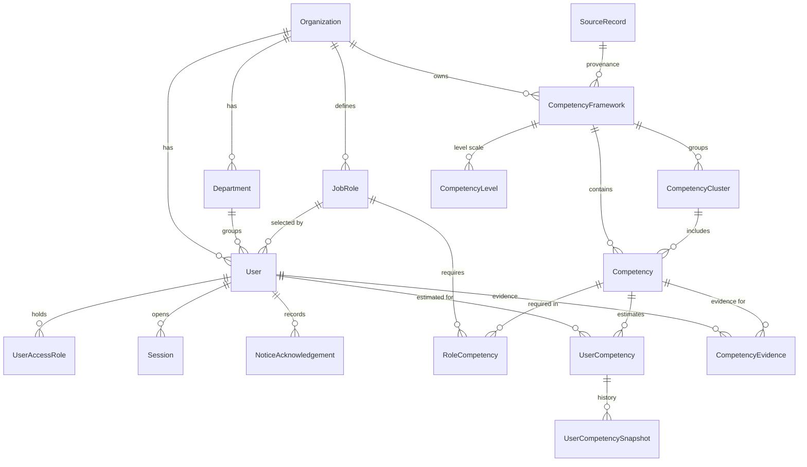
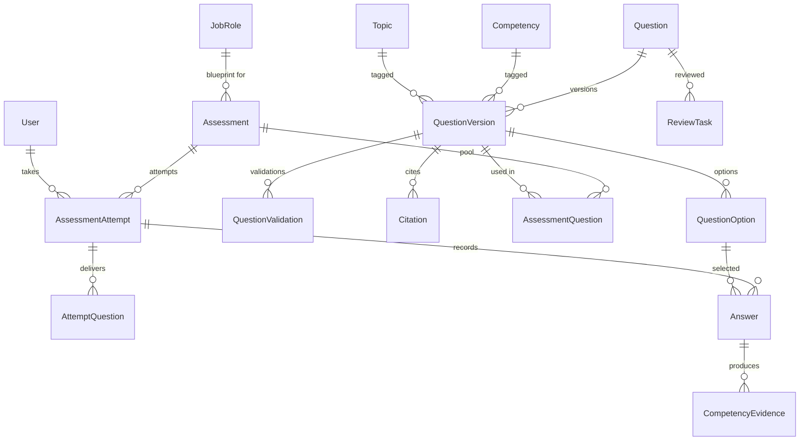
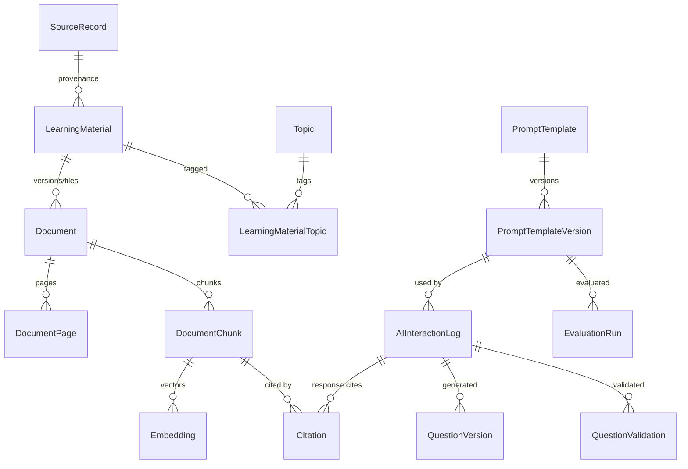
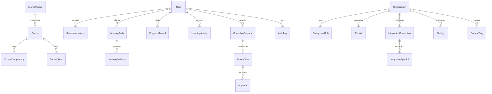

# Data Model

| Field | Value |
|---|---|
| **Version** | 1.0.0-draft |
| **Status** | Partially implemented: migrations `0001`-`0004` (§18). Other entities are planned |
| **Last updated** | 2026-09-15 |
| **Scope** | Application database (PostgreSQL + pgvector). The statistical-observation schema for official data series remains in [../DATA_DICTIONARY.md](../DATA_DICTIONARY.md); canonical seed datasets are defined in [../schemas/canonical_datasets.schema.json](../schemas/canonical_datasets.schema.json). |
| **Related** | [SYSTEM_ARCHITECTURE.md](SYSTEM_ARCHITECTURE.md) · [API_INTEGRATION_SPEC.md](API_INTEGRATION_SPEC.md) · [AI_SYSTEM_SPEC.md](AI_SYSTEM_SPEC.md) · [SECURITY_RESPONSIBLE_AI.md](SECURITY_RESPONSIBLE_AI.md) · [DATA_PROVENANCE.md](DATA_PROVENANCE.md) · [DECISIONS.md](DECISIONS.md) |

## Table of contents

1. [Conventions](#1-conventions)
2. [Entity index](#2-entity-index)
3. [ERDs](#3-erds)
4. [Organisation and identity](#4-organisation-and-identity)
5. [Job roles and competencies](#5-job-roles-and-competencies)
6. [Assessment](#6-assessment)
7. [Content and retrieval](#7-content-and-retrieval)
8. [Courses, recommendations and progress](#8-courses-recommendations-and-progress)
9. [AI governance and review](#9-ai-governance-and-review)
10. [Platform, jobs, reports and integrations](#10-platform-jobs-reports-and-integrations)
11. [P1 entities (schema reserved, no MVP behaviour)](#11-p1-entities-schema-reserved-no-mvp-behaviour)
12. [PostgreSQL considerations](#12-postgresql-considerations)
13. [pgvector considerations](#13-pgvector-considerations)
14. [Migration strategy](#14-migration-strategy)
15. [Seed-data strategy](#15-seed-data-strategy)
16. [Provenance, versioning and soft-delete summary](#16-provenance-versioning-and-soft-delete-summary)
17. [Retention classes](#17-retention-classes)
18. [Implementation notes](#18-implementation-notes)

---

## 1. Conventions

### 1.1 Standard columns

Unless an entity says otherwise, every table has these **standard columns (SC)**:

| Column | Type | Required | Notes |
|---|---|---|---|
| `id` | `uuid` | Yes | Primary key, `DEFAULT gen_random_uuid()` |
| `created_at` | `timestamptz` | Yes | `DEFAULT now()` |
| `updated_at` | `timestamptz` | Yes | Maintained by application or trigger |
| `created_by` | `uuid` → User | No | Null for system or seed actions |
| `updated_by` | `uuid` → User | No | — |

In addition:
- **Tenant-scoped (TS)** tables add `organization_id uuid NOT NULL` → Organization, indexed. Every query filters on it (DEC-024).
- **Optimistic locking (OL)** tables add `row_version integer NOT NULL DEFAULT 1`. Updates must match it, or they return 409.
- **Soft delete (SD)** tables use `status` (`active` / `inactive`) or `deleted_at timestamptz`, as stated per entity.
- **Append-only (AO)** tables allow no `UPDATE` or `DELETE` for the application database role, except explicitly listed set-once columns. This is enforced with grants and triggers. AO tables have no `updated_at` or `updated_by`.

### 1.2 Types and enums

- **Enumerations** are `text` columns with `CHECK` constraints rather than native PostgreSQL enums. This makes migrations easier (DEC-029). Allowed values are listed per field.
- **Money and cost** estimates use `numeric(12,6)`. Scores use `numeric(6,5)` in the range [0,1].
- **`jsonb` columns** have an application-level Pydantic schema and are never used for data that is filtered or joined relationally.
- **Personal data columns** are marked **PD**. They follow the access, redaction and retention rules in [SECURITY_RESPONSIBLE_AI.md](SECURITY_RESPONSIBLE_AI.md).

### 1.3 Status vocabularies

- `data_status` columns use [STATUS_VOCABULARY.md](../STATUS_VOCABULARY.md): `VERIFIED`, `UNKNOWN`, `UNAVAILABLE`, `MOCK`, `ASSUMED`, `MACHINE_OBSERVED`, `UNVERIFIED_SECONDHAND`, `EXCLUDED_BY_POLICY`, `NOT_APPLICABLE`.
- Workflow statuses (e.g. question `status`) are separate, and each is defined per entity.

## 2. Entity index

| Entity | Module | Scope | MVP | API group ([API_INTEGRATION_SPEC.md](API_INTEGRATION_SPEC.md)) |
|---|---|---|---|---|
| Organization | organization | global | Yes | Organisation |
| Department | organization | TS | Yes | Organisation |
| User | identity | TS | Yes | Users, Me |
| UserAccessRole | identity | TS | Yes | Users |
| Session | identity | TS | Yes | Auth |
| NoticeAcknowledgement | identity | TS | Yes | Me |
| JobRole ("Role" in brief) | organization | TS | Yes | Job roles |
| CompetencyFramework | competency | TS | Yes | Competencies |
| CompetencyCluster | competency | TS | Yes | Competencies |
| Competency | competency | TS | Yes | Competencies |
| CompetencyLevel | competency | TS | Yes | Competencies |
| RoleCompetency | competency | TS | Yes | Job roles |
| UserCompetency | competency | TS | Yes | Competency profile |
| UserCompetencySnapshot | competency | TS, AO | Yes | Competency profile |
| CompetencyEvidence | competency | TS, AO | Yes | Competency profile |
| Topic | platform | TS | Yes | Topics |
| Question | assessment | TS | Yes | Questions |
| QuestionVersion | assessment | TS, AO | Yes | Questions |
| QuestionOption | assessment | TS, AO | Yes | Questions |
| QuestionValidation | assessment | TS, AO | Yes | Questions |
| Assessment | assessment | TS | Yes | Assessments |
| AssessmentQuestion | assessment | TS | Yes | Assessments |
| AssessmentAttempt | assessment | TS | Yes | Attempts |
| AttemptQuestion | assessment | TS, AO | Yes | Attempts |
| Answer | assessment | TS | Yes | Attempts |
| SourceRecord | content | TS | Yes | (import only; exposed as `provenance`) |
| LearningMaterial | content | TS | Yes | Learning materials |
| LearningMaterialTopic | content | TS | Yes | Learning materials |
| Document | content | TS | Yes | Documents |
| DocumentPage | content | TS | Yes | Documents |
| DocumentChunk | content | TS | Yes | Search, Document Q&A |
| Embedding | retrieval | TS | Yes | Search (internal) |
| Citation | ai | TS, AO | Yes | Document Q&A, Questions |
| Course | recommendation | TS | Yes | Courses |
| CourseCompetency | recommendation | TS | Yes | Courses |
| CourseTopic | recommendation | TS | Yes | Courses |
| Recommendation | recommendation | TS | Yes | Recommendations |
| LearningPath | recommendation | TS | Yes | Learning paths |
| LearningPathItem | recommendation | TS | Yes | Learning paths |
| LearningActivity | progress | TS, AO | Yes | Progress |
| ProgressRecord | progress | TS | Yes | Progress |
| PromptTemplate | ai | global | Yes | Admin (prompt registry) |
| PromptTemplateVersion | ai | global, AO | Yes | Admin (prompt registry) |
| EvaluationRun | ai | global, AO | Yes | Admin (prompt registry) |
| AIInteractionLog | ai | TS, AO | Yes | Audit |
| ReviewTask | governance | TS | Yes | Review tasks |
| Approval | governance | TS, AO | Yes | Review tasks |
| CorrectionRequest | governance | TS | Yes | Corrections |
| AuditLog | governance | TS, AO | Yes | Audit |
| BackgroundJob | jobs | TS | Yes | Jobs |
| IdempotencyKey | jobs | TS | Yes | (header handling) |
| Setting | platform | TS | Yes | Admin settings |
| FeatureFlag | platform | TS/global | Yes | Admin settings |
| Report | reporting | TS | Yes | Reports |
| IntegrationConnection | integrations | TS | Yes | Integrations |
| IntegrationSyncJob | integrations | TS | P1 (table reserved) | Integrations (P1) |
| Notification | platform | TS | P1 | Notifications (P1) |
| TutorConversation | ai | TS | P1 | Tutor (P1) |
| TutorMessage | ai | TS | P1 | Tutor (P1) |
| Badge | platform | TS | P1 | Gamification (P1) |
| UserBadge | platform | TS | P1 | Gamification (P1) |
| Certificate | platform | TS | P1 | Certificates (P1) |

**Reserved tables:** P1 tables may be created only when their phase begins, unless a migration adding them early is justified in [DECISIONS.md](DECISIONS.md). They must carry no MVP behaviour ([MVP_SCOPE.md](MVP_SCOPE.md) §5).

## 3. ERDs

### 3.1 Organisation, identity and competency

### 3.2 Assessment

### 3.3 Content, retrieval and AI

### 3.4 Learning, governance and platform

---

## 4. Organisation and identity

### Organization

- **Purpose:** Tenant boundary, e.g. one statistical organisation.
- **Fields:** SC, plus the following.

| Field | Type | Req | Notes |
|---|---|---|---|
| `name` | `text` | Yes | Unique |
| `code` | `text` | Yes | Unique, slug |
| `status` | `text` | Yes | `active`, `inactive` |
| `settings_row_version` | `integer` | Yes | Bumped on settings change (cache invalidation) |

- **Relationships:** Has many Department, User, JobRole, CompetencyFramework and all tenant-scoped tables.
- **Indexes:** Unique `code`; unique `lower(name)`.
- **Constraints:** Cannot be deleted while any tenant data exists (`ON DELETE RESTRICT`).
- **Tenant scope:** Global (root).
- **Audit:** Create, status change.
- **Retention:** Life of deployment.

### Department

- **Purpose:** Organisational unit for scoping administration and aggregates.
- **Fields:** SC, TS, SD (`status`), plus:

| Field | Type | Req | Notes |
|---|---|---|---|
| `name` | `text` | Yes | |
| `code` | `text` | No | |
| `status` | `text` | Yes | `active`, `inactive` |

- **Relationships:** Belongs to Organization; has many User.
- **Indexes:** Unique `(organization_id, lower(name))`.
- **Constraints:** Cannot be deactivated while active users are assigned. Users must be reassigned first.
- **Tenant scope:** TS.
- **Audit:** Create, update, deactivate.
- **Retention:** Retained while referenced.

### User

- **Purpose:** Platform account for a person.
- **Fields:** SC, TS, OL, plus:

| Field | Type | Req | Notes |
|---|---|---|---|
| `email` | `citext` | Yes | **PD**; unique per organisation |
| `display_name` | `text` | Yes | **PD** |
| `designation` | `text` | No | **PD** |
| `department_id` | `uuid` → Department | No | |
| `job_role_id` | `uuid` → JobRole | No | Selected job role |
| `locale` | `text` | Yes | Default `en`; allowed: `en` (MVP), `hi` (P1) |
| `password_hash` | `text` | No | Argon2id. Null when SSO-only (P1). Never exposed. |
| `status` | `text` | Yes | `invited`, `active`, `locked`, `inactive` |
| `failed_login_count` | `integer` | Yes | Default 0 |
| `locked_until` | `timestamptz` | No | |
| `last_login_at` | `timestamptz` | No | |
| `onboarding_completed_at` | `timestamptz` | No | |
| `is_synthetic` | `boolean` | Yes | Default false. True for demo and seed users; cannot exist in `pilot` or `production` (startup check). |

- **Relationships:** Many UserAccessRole, Session, AssessmentAttempt, UserCompetency, ProgressRecord, and so on.
- **Indexes:** Unique `(organization_id, email)`; `(organization_id, department_id)`; `(organization_id, job_role_id)`.
- **Constraints:** `status` check. At least one active `org_admin` per organisation, enforced in the service layer.
- **Tenant scope:** TS.
- **Audit:** Create, status change, access-role change, job-role change, password change (value never logged).
- **Retention:** Account data class ([§17](#17-retention-classes)). Deactivation rather than deletion in MVP. Deletion and pseudonymisation are P1 (SEC-019).

### UserAccessRole

- **Purpose:** RBAC assignment. These are access roles, not job roles (DEC-012).
- **Fields:** SC, TS, plus:

| Field | Type | Req | Notes |
|---|---|---|---|
| `user_id` | `uuid` → User | Yes | |
| `role` | `text` | Yes | `learner`, `trainer`, `department_admin`, `org_admin`, `competency_admin`, `training_manager`, `auditor`, `platform_admin` |
| `department_scope_id` | `uuid` → Department | No | Required for `department_admin`; optional scope for `trainer` and `training_manager` |

- **Relationships:** Belongs to User.
- **Indexes:** Unique `(user_id, role, coalesce(department_scope_id, '00000000-0000-0000-0000-000000000000'))`.
- **Constraints:** `department_admin` requires `department_scope_id`. `platform_admin` assignable only by `platform_admin`.
- **Tenant scope:** TS.
- **Audit:** Grant and revoke (actor, reason).
- **Retention:** Account data class. Historical grants remain in AuditLog.

### Session

- **Purpose:** Server-side session store (DEC-007).
- **Fields:** `id` (hash of the session token, `text` PK), TS, plus:

| Field | Type | Req | Notes |
|---|---|---|---|
| `user_id` | `uuid` → User | Yes | |
| `created_at` | `timestamptz` | Yes | |
| `last_seen_at` | `timestamptz` | Yes | |
| `idle_expires_at` | `timestamptz` | Yes | |
| `absolute_expires_at` | `timestamptz` | Yes | |
| `revoked_at` | `timestamptz` | No | |
| `reauthenticated_at` | `timestamptz` | No | For sensitive actions (SEC-005) |
| `ip_hash` | `text` | No | **PD**; salted hash |
| `user_agent` | `text` | No | Truncated |

- **Indexes:** `(user_id)`; `(absolute_expires_at)` for purge.
- **Constraints:** Raw token never stored.
- **Tenant scope:** TS.
- **Audit:** Login and logout events in AuditLog, not per session row.
- **Retention:** Purge 30 days after expiry (proposed; Decision required under DEC-027).

### NoticeAcknowledgement

- **Purpose:** Records acknowledgement of the privacy and AI-use notice (MVP-03).
- **Fields:** `id`, TS, `created_at`, AO, plus:

| Field | Type | Req | Notes |
|---|---|---|---|
| `user_id` | `uuid` → User | Yes | |
| `notice_type` | `text` | Yes | `privacy_ai_use` |
| `notice_version` | `text` | Yes | |
| `acknowledged_at` | `timestamptz` | Yes | |

- **Indexes:** Unique `(user_id, notice_type, notice_version)`.
- **Tenant scope:** TS.
- **Audit:** The row itself is the record.
- **Retention:** Account data class.

---

## 5. Job roles and competencies

### JobRole

Called "Role" in the product brief. Named `JobRole` to avoid confusion with access roles (DEC-012).

- **Purpose:** A statistical job role with competency requirements.
- **Fields:** SC, TS, OL, SD (`status`), plus:

| Field | Type | Req | Notes |
|---|---|---|---|
| `name` | `text` | Yes | |
| `code` | `text` | No | |
| `description` | `text` | No | |
| `department_id` | `uuid` → Department | No | Null means organisation-wide |
| `status` | `text` | Yes | `active`, `inactive` |

- **Relationships:** Has many RoleCompetency, Assessment (blueprints) and User (selected).
- **Indexes:** Unique `(organization_id, lower(name))`.
- **Constraints:** Soft-deactivate only.
- **Tenant scope:** TS.
- **Audit:** Create, update, deactivate.
- **Retention:** Retained while referenced.

### CompetencyFramework

- **Purpose:** A competency framework: an imported reference framework (e.g. CSCD, structure only) or an organisation-authored functional framework.
- **Fields:** SC, TS, OL, plus:

| Field | Type | Req | Notes |
|---|---|---|---|
| `name` | `text` | Yes | |
| `code` | `text` | Yes | e.g. `CSCD-2014` |
| `framework_type` | `text` | Yes | `reference_behavioural`, `functional` |
| `publisher` | `text` | No | e.g. DoPT |
| `version_label` | `text` | Yes | |
| `status` | `text` | Yes | `draft`, `approved`, `retired` |
| `definitions_restricted` | `boolean` | Yes | True for CSCD. Blocks storing definition text. |
| `source_record_id` | `uuid` → SourceRecord | No | Required for imported frameworks |
| `approved_by` | `uuid` → User | No | |
| `approved_at` | `timestamptz` | No | |

- **Relationships:** Has many CompetencyCluster, Competency and CompetencyLevel.
- **Indexes:** Unique `(organization_id, code, version_label)`.
- **Constraints:** `status='approved'` requires `approved_by` and `approved_at`. Approved frameworks are immutable except retirement; changes create a new `version_label`.
- **Tenant scope:** TS.
- **Audit:** Create, approve, retire.
- **Retention:** Retained indefinitely while referenced by evidence.

### CompetencyCluster

- **Purpose:** Grouping within a framework (e.g. CSCD Ethos, Ethics, Equity, Efficiency).
- **Fields:** SC, TS, plus:

| Field | Type | Req | Notes |
|---|---|---|---|
| `framework_id` | `uuid` → CompetencyFramework | Yes | |
| `code` | `text` | Yes | |
| `name` | `text` | Yes | |
| `source_page` | `integer` | No | |

- **Indexes:** Unique `(framework_id, code)`.
- **Tenant scope:** TS.
- **Audit:** Via framework changes.
- **Retention:** With framework.

### Competency

- **Purpose:** A single competency.
- **Fields:** SC, TS, OL, plus:

| Field | Type | Req | Notes |
|---|---|---|---|
| `framework_id` | `uuid` → CompetencyFramework | Yes | |
| `cluster_id` | `uuid` → CompetencyCluster | No | |
| `code` | `text` | Yes | e.g. `4.8` |
| `name` | `text` | Yes | |
| `name_variants` | `text[]` | Yes | Default `{}` |
| `description` | `text` | No | **Must be null** when `framework.definitions_restricted` |
| `definition_source_page` | `integer` | No | |
| `detail_source_page` | `integer` | No | |
| `status` | `text` | Yes | `active`, `inactive` |
| `data_status` | `text` | Yes | e.g. `MACHINE_OBSERVED` for imports |

- **Relationships:** Has many RoleCompetency, UserCompetency, CompetencyEvidence, QuestionVersion and CourseCompetency.
- **Indexes:** Unique `(framework_id, code)`.
- **Constraints:** Trigger or service check rejects a non-null `description` when the framework's definitions are restricted.
- **Tenant scope:** TS.
- **Audit:** Create, update.
- **Retention:** With framework.

### CompetencyLevel

- **Purpose:** Level scale and provisional score thresholds per framework.
- **Fields:** SC, TS, plus:

| Field | Type | Req | Notes |
|---|---|---|---|
| `framework_id` | `uuid` → CompetencyFramework | Yes | |
| `level_number` | `smallint` | Yes | 1..N |
| `label` | `text` | Yes | e.g. `Level 1` |
| `description` | `text` | No | Null when restricted |
| `min_score` | `numeric(6,5)` | No | Lower bound for this level |
| `threshold_status` | `text` | Yes | `provisional`, `approved` |

- **Indexes:** Unique `(framework_id, level_number)`.
- **Constraints:** `min_score` must increase with `level_number`.
- **Tenant scope:** TS.
- **Audit:** Threshold changes (they affect estimates).
- **Retention:** With framework. Changes create new scoring method versions (§6 of [AI_SYSTEM_SPEC.md](AI_SYSTEM_SPEC.md) §25).

### RoleCompetency

- **Purpose:** Required level of a competency for a job role.
- **Fields:** SC, TS, OL, plus:

| Field | Type | Req | Notes |
|---|---|---|---|
| `job_role_id` | `uuid` → JobRole | Yes | |
| `competency_id` | `uuid` → Competency | Yes | |
| `required_level_number` | `smallint` | Yes | |
| `mapping_version` | `integer` | Yes | |
| `status` | `text` | Yes | `draft`, `approved`, `retired` |
| `approved_by` | `uuid` → User | No | |
| `approved_at` | `timestamptz` | No | |
| `is_critical` | `boolean` | No | P1 column; no MVP behaviour |

- **Indexes:** Unique `(job_role_id, competency_id, mapping_version)`; partial unique `(job_role_id, competency_id) WHERE status='approved'`.
- **Constraints:** `required_level_number` must exist in the competency's framework level scale.
- **Tenant scope:** TS.
- **Audit:** Create, approve, retire.
- **Retention:** Retained (gap history references `mapping_version`).

### UserCompetency

- **Purpose:** Current competency estimate for a user.
- **Fields:** SC, TS, plus:

| Field | Type | Req | Notes |
|---|---|---|---|
| `user_id` | `uuid` → User | Yes | **PD** (linked) |
| `competency_id` | `uuid` → Competency | Yes | |
| `job_role_id` | `uuid` → JobRole | No | Role context at computation |
| `role_mapping_version` | `integer` | No | |
| `score` | `numeric(6,5)` | No | Null when no evidence |
| `level_number` | `smallint` | No | Null when thresholds are not configured |
| `evidence_band` | `text` | Yes | `insufficient`, `low`, `medium`, `high` |
| `evidence_count` | `integer` | Yes | |
| `method_version` | `text` | Yes | e.g. `score-v1` |
| `explanation` | `jsonb` | Yes | Structured explanation block |
| `is_stale` | `boolean` | Yes | |
| `computed_at` | `timestamptz` | Yes | |

- **Indexes:** Unique `(user_id, competency_id)`; `(organization_id, competency_id)` for aggregates (P1).
- **Constraints:** `score` is null when `evidence_count = 0`.
- **Tenant scope:** TS.
- **Audit:** Recomputations are recorded as snapshots; adjustments are recorded as evidence and AuditLog entries.
- **Retention:** Competency record class.

### UserCompetencySnapshot

- **Purpose:** Append-only history of estimates, including the immutable baseline (PRO-003).
- **Fields:** `id`, TS, `created_at`, AO, plus:

| Field | Type | Req | Notes |
|---|---|---|---|
| `user_id` | `uuid` → User | Yes | |
| `competency_id` | `uuid` → Competency | Yes | |
| `score` | `numeric(6,5)` | No | |
| `level_number` | `smallint` | No | |
| `evidence_band` | `text` | Yes | |
| `evidence_count` | `integer` | Yes | |
| `method_version` | `text` | Yes | |
| `snapshot_reason` | `text` | Yes | `baseline`, `attempt_scored`, `adjustment`, `evidence_voided`, `recompute` |
| `attempt_id` | `uuid` → AssessmentAttempt | No | |

- **Indexes:** `(user_id, competency_id, created_at)`; partial unique `(user_id, competency_id) WHERE snapshot_reason='baseline'`.
- **Tenant scope:** TS.
- **Audit:** The row itself is the record.
- **Retention:** Competency record class.

### CompetencyEvidence

- **Purpose:** Append-only evidence ledger (AI-016, CMP-016).
- **Fields:** `id`, TS, `created_at`, `created_by`, AO (set-once void columns), plus:

| Field | Type | Req | Notes |
|---|---|---|---|
| `user_id` | `uuid` → User | Yes | |
| `competency_id` | `uuid` → Competency | Yes | |
| `evidence_type` | `text` | Yes | `assessment_answer`, `human_adjustment` (MVP); `learning_activity` (P1) |
| `attempt_id` | `uuid` → AssessmentAttempt | No | |
| `answer_id` | `uuid` → Answer | No | Required for `assessment_answer` |
| `question_version_id` | `uuid` → QuestionVersion | No | |
| `difficulty_weight` | `numeric(4,2)` | No | |
| `is_correct` | `boolean` | No | |
| `adjusted_level_number` | `smallint` | No | For `human_adjustment` |
| `reason` | `text` | No | Required for `human_adjustment` |
| `voided_at` | `timestamptz` | No | Set once |
| `voided_by` | `uuid` → User | No | Set once |
| `void_reason` | `text` | No | Set once, required with `voided_at` |

- **Indexes:** `(user_id, competency_id) WHERE voided_at IS NULL`; `(answer_id)`.
- **Constraints:** `CHECK` on the fields required for each `evidence_type`. The trigger allows only the one-time setting of the void columns. For `human_adjustment`, `created_by` ≠ `user_id`.
- **Tenant scope:** TS.
- **Audit:** Adjustments and voids also create AuditLog entries.
- **Retention:** Competency record class.

### Topic

- **Purpose:** Taxonomy term (seeded from `data/processed/topics.json`, ASSUMED).
- **Fields:** SC, TS, plus:

| Field | Type | Req | Notes |
|---|---|---|---|
| `code` | `text` | Yes | e.g. `national_accounts` |
| `label` | `text` | Yes | |
| `taxonomy_version` | `text` | Yes | e.g. `0.1.2` |
| `data_status` | `text` | Yes | `ASSUMED` until reviewed |
| `review_status` | `text` | Yes | `unreviewed`, `approved`, `retired` |

- **Indexes:** Unique `(organization_id, code)`.
- **Tenant scope:** TS.
- **Audit:** Review status changes.
- **Retention:** Retained while referenced.

---

## 6. Assessment

### Question

- **Purpose:** Stable identity and workflow state of a question across versions.
- **Fields:** SC, TS, OL, plus:

| Field | Type | Req | Notes |
|---|---|---|---|
| `origin` | `text` | Yes | `ai_generated`, `human_authored` |
| `status` | `text` | Yes | `pending_validation`, `failed_validation`, `validation_incomplete`, `in_review`, `approved`, `rejected`, `suspended`, `retired` ([SYSTEM_ARCHITECTURE.md](SYSTEM_ARCHITECTURE.md) §13) |
| `current_version_id` | `uuid` → QuestionVersion | No | |
| `approved_version_id` | `uuid` → QuestionVersion | No | Last approved version usable in assessments |
| `generation_job_id` | `uuid` → BackgroundJob | No | |

- **Relationships:** Has many QuestionVersion and ReviewTask.
- **Indexes:** `(organization_id, status)`.
- **Constraints:** `status='approved'` requires `approved_version_id`.
- **Tenant scope:** TS.
- **Audit:** Status transitions.
- **Retention:** Question bank class.

### QuestionVersion

- **Purpose:** Immutable question content with AI metadata.
- **Fields:** `id`, TS, `created_at`, `created_by`, AO, plus:

| Field | Type | Req | Notes |
|---|---|---|---|
| `question_id` | `uuid` → Question | Yes | |
| `version_number` | `integer` | Yes | |
| `question_type` | `text` | Yes | `mcq_single` (MVP) |
| `stem` | `text` | Yes | |
| `explanation` | `text` | Yes | |
| `difficulty` | `text` | Yes | `foundational`, `intermediate`, `advanced` |
| `difficulty_confirmed` | `boolean` | Yes | |
| `competency_id` | `uuid` → Competency | Yes | |
| `topic_id` | `uuid` → Topic | No | |
| `content_hash` | `text` | Yes | Normalised stem and options hash for exact-duplicate detection |
| `stem_embedding` | `vector(D)` | No | D per DEC-006; near-duplicate detection |
| `ai_interaction_id` | `uuid` → AIInteractionLog | No | Set when AI-generated |
| `prompt_template_version_id` | `uuid` → PromptTemplateVersion | No | |
| `model_id` | `text` | No | |
| `generation_parameters` | `jsonb` | No | |
| `edited_from_version_id` | `uuid` → QuestionVersion | No | |
| `human_edited_fields` | `text[]` | Yes | Default `{}` |
| `language` | `text` | Yes | `en` |

- **Relationships:** Has many QuestionOption, QuestionValidation and Citation.
- **Indexes:** Unique `(question_id, version_number)`; `(organization_id, content_hash)`; `(competency_id, difficulty)`; HNSW on `stem_embedding` (§13).
- **Constraints:** AI-generated versions require `ai_interaction_id`, `prompt_template_version_id` and `model_id`. At least one Citation is required before approval (service check).
- **Tenant scope:** TS.
- **Audit:** Creation recorded; approvals in Approval.
- **Retention:** Question bank class. Never deleted while referenced by attempts.

### QuestionOption

- **Purpose:** Answer options for a question version.
- **Fields:** `id`, TS, `created_at`, AO, plus:

| Field | Type | Req | Notes |
|---|---|---|---|
| `question_version_id` | `uuid` → QuestionVersion | Yes | |
| `label` | `text` | Yes | `A`..`D` |
| `text` | `text` | Yes | |
| `is_correct` | `boolean` | Yes | **Never serialised** in learner-facing responses before submission |
| `position` | `smallint` | Yes | Canonical order |

- **Indexes:** Unique `(question_version_id, label)`; partial unique `(question_version_id) WHERE is_correct`.
- **Constraints:** Exactly 4 options and exactly 1 correct option for `mcq_single` (service check at validation).
- **Tenant scope:** TS.
- **Audit:** Via version.
- **Retention:** With version.

### QuestionValidation

- **Purpose:** Result of each automated validator (MVP-15).
- **Fields:** `id`, TS, `created_at`, AO, plus:

| Field | Type | Req | Notes |
|---|---|---|---|
| `question_version_id` | `uuid` → QuestionVersion | Yes | |
| `validator` | `text` | Yes | `schema`, `structure`, `span_match`, `exact_duplicate`, `near_duplicate`, `key_check`, `support_check` |
| `validator_version` | `text` | Yes | |
| `result` | `text` | Yes | `pass`, `fail`, `warn`, `error` |
| `details` | `jsonb` | Yes | e.g. similar question IDs, validator's chosen option, reason |
| `ai_interaction_id` | `uuid` → AIInteractionLog | No | For LLM validators |

- **Indexes:** `(question_version_id, validator)`.
- **Tenant scope:** TS.
- **Audit:** The row itself is the record.
- **Retention:** Question bank class.

### Assessment

- **Purpose:** Assessment definition and blueprint.
- **Fields:** SC, TS, OL, plus:

| Field | Type | Req | Notes |
|---|---|---|---|
| `title` | `text` | Yes | |
| `purpose` | `text` | Yes | `pre`, `practice`, `topic`, `competency` (MVP); `post` (P1); `certification` (P2) |
| `job_role_id` | `uuid` → JobRole | No | Required for `pre` |
| `blueprint` | `jsonb` | Yes | Competencies, topics, counts, `min_items_per_competency` |
| `feedback_policy` | `text` | Yes | `score_only`, `correctness`, `correctness_and_explanations` |
| `status` | `text` | Yes | `draft`, `published`, `retired` |
| `published_at` | `timestamptz` | No | |
| `published_by` | `uuid` → User | No | |

- **Indexes:** `(organization_id, status)`; partial unique `(job_role_id) WHERE purpose='pre' AND status='published'`.
- **Constraints:** Publishing requires all pool items to be approved question versions and blueprint minimums to be met (service check). Published assessments are immutable except retirement.
- **Tenant scope:** TS.
- **Audit:** Publish, retire.
- **Retention:** Assessment record class.

### AssessmentQuestion

- **Purpose:** Pool of question versions for an assessment.
- **Fields:** SC, TS, plus `assessment_id` (→ Assessment, req) and `question_version_id` (→ QuestionVersion, req).
- **Indexes:** Unique `(assessment_id, question_version_id)`.
- **Constraints:** Question version must be the approved version at publish time.
- **Tenant scope:** TS.
- **Audit:** Via publish.
- **Retention:** With assessment.

### AssessmentAttempt

- **Purpose:** A learner's attempt.
- **Fields:** SC, TS, OL, plus:

| Field | Type | Req | Notes |
|---|---|---|---|
| `assessment_id` | `uuid` → Assessment | Yes | |
| `user_id` | `uuid` → User | Yes | |
| `status` | `text` | Yes | `in_progress`, `submitted`, `scored`, `scoring_failed`, `expired`, `voided` (local/ci demo reset only, DEC-052) |
| `seed` | `bigint` | Yes | Randomisation seed (ASM-014) |
| `started_at` | `timestamptz` | Yes | |
| `expires_at` | `timestamptz` | No | |
| `submitted_at` | `timestamptz` | No | |
| `scored_at` | `timestamptz` | No | |
| `score_total` | `numeric(6,5)` | No | |
| `is_baseline` | `boolean` | Yes | |
| `rescored_at` | `timestamptz` | No | |
| `voided_at` | `timestamptz` | No | Set together with `void_reason` exactly when `status = 'voided'` (migration `0004`) |
| `void_reason` | `text` | No | |

- **Indexes:** `(user_id, assessment_id)`; partial unique `(user_id) WHERE is_baseline AND status <> 'voided'` (one baseline per user in MVP; per role in P1: Decision required).
- **Constraints:** Only the owner may write answers. The submit transition happens once.
- **Tenant scope:** TS.
- **Audit:** Submit, rescore.
- **Retention:** Assessment record class.

### AttemptQuestion

- **Purpose:** The exact questions, order and option order delivered in an attempt.
- **Fields:** `id`, TS, `created_at`, AO, plus:

| Field | Type | Req | Notes |
|---|---|---|---|
| `attempt_id` | `uuid` → AssessmentAttempt | Yes | |
| `question_version_id` | `uuid` → QuestionVersion | Yes | |
| `position` | `smallint` | Yes | |
| `option_order` | `text[]` | Yes | Delivered label order |

- **Indexes:** Unique `(attempt_id, position)`; unique `(attempt_id, question_version_id)`.
- **Tenant scope:** TS.
- **Audit:** Not required.
- **Retention:** With attempt.

### Answer

- **Purpose:** Learner's response to a delivered question.
- **Fields:** SC, TS, plus:

| Field | Type | Req | Notes |
|---|---|---|---|
| `attempt_id` | `uuid` → AssessmentAttempt | Yes | |
| `question_version_id` | `uuid` → QuestionVersion | Yes | |
| `selected_option_id` | `uuid` → QuestionOption | No | Null for skipped |
| `answered_at` | `timestamptz` | No | |
| `is_correct` | `boolean` | No | Set at scoring |
| `scored_at` | `timestamptz` | No | |
| `rescore_count` | `integer` | Yes | |

- **Indexes:** Unique `(attempt_id, question_version_id)`.
- **Constraints:** Selected option belongs to the question version. Editable only while the attempt is `in_progress`.
- **Tenant scope:** TS.
- **Audit:** Rescoring.
- **Retention:** Assessment record class.

---

## 7. Content and retrieval

### SourceRecord

- **Purpose:** Provenance for anything imported from an external or canonical source (DATA_PROVENANCE.md).
- **Fields:** SC, TS, plus:

| Field | Type | Req | Notes |
|---|---|---|---|
| `registry_source_id` | `text` | Yes | e.g. `SRC-001`, `SRC-025`, `SRC-026` (registry/source_registry.csv) |
| `source_document_id` | `text` | No | e.g. `MOSPI-DOC-004` |
| `source_url` | `text` | Yes | |
| `source_organisation` | `text` | Yes | |
| `retrieval_date` | `date` | No | |
| `access_method` | `text` | Yes | |
| `source_sha256` | `text` | No | |
| `raw_local_path` | `text` | No | Local-only path (git-ignored raw) |
| `canonical_dataset` | `text` | No | e.g. `training_programmes` |
| `canonical_record_id` | `text` | No | e.g. `NSSTA-PRG-5e2a1a8c54` |
| `canonical_dataset_sha256` | `text` | No | Input fingerprint at import |
| `data_status` | `text` | Yes | Status vocabulary |
| `licence_status` | `text` | Yes | Status vocabulary |
| `licence_notes` | `text` | Yes | |
| `attribution_text` | `text` | Yes | |
| `review_verified` | `boolean` | Yes | Human verification flag from the canonical record (currently false for all) |

- **Indexes:** Unique `(organization_id, canonical_dataset, canonical_record_id)`.
- **Constraints:** `data_status='MOCK'` is prohibited (mock data is never imported).
- **Tenant scope:** TS.
- **Audit:** Import runs recorded in AuditLog (`seed.import`).
- **Retention:** Life of referencing records.

### LearningMaterial

- **Purpose:** Logical learning item owning one or more document files (versions in P1).
- **Fields:** SC, TS, OL, SD (`status`), plus:

| Field | Type | Req | Notes |
|---|---|---|---|
| `title` | `text` | Yes | |
| `title_status` | `text` | Yes | Status vocabulary |
| `description` | `text` | No | |
| `material_type` | `text` | Yes | e.g. `methodology_manual`, `training_calendar`, `competency_framework` |
| `source_organisation` | `text` | Yes | |
| `access_scope` | `text` | Yes | `organization`, `department`, `restricted` |
| `department_scope_id` | `uuid` → Department | No | Required when `department` |
| `licence_status` | `text` | Yes | |
| `licence_notes` | `text` | Yes | |
| `attribution_text` | `text` | Yes | |
| `generation_permitted` | `boolean` | Yes | Default false; true only with permissive licence confirmation (DEC-023) |
| `learner_display_permitted` | `boolean` | Yes | Default false |
| `series_base_year` | `text` | No | LP-20 |
| `series_base_year_status` | `text` | Yes | |
| `source_record_id` | `uuid` → SourceRecord | No | |
| `uploaded_by` | `uuid` → User | No | |
| `attested_at` | `timestamptz` | No | Uploader attestation |
| `status` | `text` | Yes | `active`, `inactive`, `quarantined` |

- **Relationships:** Has many Document and LearningMaterialTopic.
- **Indexes:** `(organization_id, status)`; `(organization_id, material_type)`.
- **Constraints:** `generation_permitted` cannot be true when `licence_status` is not `VERIFIED`, except with a recorded platform decision for internal development using public documents (DEC-023). Restricted frameworks (CSCD) have `generation_permitted=false`.
- **Tenant scope:** TS.
- **Audit:** Create, licence/permission changes, deactivation, quarantine release.
- **Retention:** Content class.

### LearningMaterialTopic

- **Purpose:** Topic tags on materials with review status.
- **Fields:** SC, TS, plus:

| Field | Type | Req | Notes |
|---|---|---|---|
| `learning_material_id` | `uuid` → LearningMaterial | Yes | |
| `topic_id` | `uuid` → Topic | Yes | |
| `method` | `text` | Yes | `manifest_assigned`, `keyword_rule`, `human` |
| `status` | `text` | Yes | `suggested`, `approved`, `rejected` |

- **Indexes:** Unique `(learning_material_id, topic_id)`.
- **Tenant scope:** TS.
- **Audit:** Approve and reject.
- **Retention:** With material.

### Document

- **Purpose:** An uploaded or imported file and its processing state.
- **Fields:** SC, TS, OL, plus:

| Field | Type | Req | Notes |
|---|---|---|---|
| `learning_material_id` | `uuid` → LearningMaterial | Yes | |
| `version_number` | `integer` | Yes | 1 in MVP |
| `sha256` | `text` | Yes | |
| `storage_key` | `text` | Yes | Opaque |
| `original_filename` | `text` | Yes | Sanitised |
| `mime_type` | `text` | Yes | `application/pdf`, DOCX MIME, `text/plain` |
| `bytes` | `bigint` | Yes | |
| `page_count` | `integer` | No | |
| `has_text_layer` | `boolean` | No | |
| `processing_status` | `text` | Yes | `uploaded`, `extracting`, `chunking`, `embedding`, `ready`, `needs_ocr`, `quarantined`, `failed` |
| `processing_error_code` | `text` | No | |
| `malware_scan_status` | `text` | Yes | `not_scanned` (MVP placeholder), `clean`, `infected` |
| `pii_screen_status` | `text` | Yes | `not_screened`, `clear`, `flagged`, `released` |
| `extraction_tool` | `text` | No | e.g. `pypdf` |
| `chunker_version` | `text` | No | |
| `languages_detected` | `text[]` | Yes | Default `{}` |
| `pdf_creation_date` | `date` | No | Not a publication date |
| `publication_date` | `date` | No | |
| `publication_date_status` | `text` | Yes | |
| `superseded_by_document_id` | `uuid` → Document | No | P1 column |

- **Indexes:** Unique `(organization_id, sha256)`; `(processing_status)`.
- **Constraints:** Only `ready` documents are searchable and usable by AI.
- **Tenant scope:** TS.
- **Audit:** Upload, reprocess, quarantine decisions, download of `restricted` documents.
- **Retention:** Content class.

### DocumentPage

- **Purpose:** Extracted page text with page mapping.
- **Fields:** SC, TS, plus:

| Field | Type | Req | Notes |
|---|---|---|---|
| `document_id` | `uuid` → Document | Yes | |
| `page_number` | `integer` | Yes | 1-based |
| `text_raw` | `text` | Yes | |
| `text_clean` | `text` | Yes | |
| `cleaning_version` | `text` | Yes | |

- **Indexes:** Unique `(document_id, page_number)`.
- **Tenant scope:** TS.
- **Audit:** Not required.
- **Retention:** Content class.

### DocumentChunk

- **Purpose:** Retrieval unit.
- **Fields:** SC, TS, plus:

| Field | Type | Req | Notes |
|---|---|---|---|
| `document_id` | `uuid` → Document | Yes | |
| `learning_material_id` | `uuid` → LearningMaterial | Yes | Denormalised for ACL filtering |
| `chunk_index` | `integer` | Yes | |
| `chunker_version` | `text` | Yes | |
| `page_start` | `integer` | No | |
| `page_end` | `integer` | No | |
| `char_start` | `integer` | Yes | Offsets within the normalised document text |
| `char_end` | `integer` | Yes | |
| `text` | `text` | Yes | |
| `token_count` | `integer` | Yes | |
| `search_tsv` | `tsvector` | Yes | `GENERATED ALWAYS AS (to_tsvector('english', text)) STORED` |
| `risk_flags` | `text[]` | Yes | Default `{}`; e.g. `injection_pattern`, `pii_pattern` ([AI_SYSTEM_SPEC.md](AI_SYSTEM_SPEC.md) §36) |
| `risk_review_status` | `text` | Yes | `not_flagged`, `flagged`, `cleared`, `excluded` |

- **Indexes:** Unique `(document_id, chunker_version, chunk_index)`; GIN `(search_tsv)`; `(organization_id, learning_material_id)`; partial `(document_id) WHERE risk_review_status='flagged'`.
- **Constraints:** `char_end > char_start`; `page_end >= page_start`.
- **Tenant scope:** TS.
- **Audit:** Not required.
- **Retention:** Content class; removed with document.

### Embedding

- **Purpose:** Vector for a chunk under a specific embedding model.
- **Fields:** `id`, TS, `created_at`, plus:

| Field | Type | Req | Notes |
|---|---|---|---|
| `chunk_id` | `uuid` → DocumentChunk | Yes | `ON DELETE CASCADE` |
| `model_id` | `text` | Yes | Provider and model identifier |
| `dimension` | `integer` | Yes | Must equal D of the column |
| `vector` | `vector(D)` | Yes | D fixed per deployment (DEC-006) |

- **Indexes:** Unique `(chunk_id, model_id)`; HNSW `vector_cosine_ops` partial index `WHERE model_id = '<active model>'` (§13).
- **Constraints:** `dimension = D`.
- **Tenant scope:** TS.
- **Audit:** Not required (embedding jobs recorded in BackgroundJob).
- **Retention:** Content class.

### Citation

- **Purpose:** Link from an AI or question artefact to a source passage.
- **Fields:** `id`, TS, `created_at`, AO, plus:

| Field | Type | Req | Notes |
|---|---|---|---|
| `question_version_id` | `uuid` → QuestionVersion | No | Exactly one owner |
| `ai_interaction_id` | `uuid` → AIInteractionLog | No | Exactly one owner |
| `document_id` | `uuid` → Document | Yes | |
| `chunk_id` | `uuid` → DocumentChunk | Yes | |
| `page_start` | `integer` | No | |
| `page_end` | `integer` | No | |
| `quoted_span` | `text` | Yes | ≤ 1000 chars |
| `verified` | `boolean` | Yes | |
| `verification_method` | `text` | Yes | `span_match_normalized_v1` |
| `verified_at` | `timestamptz` | No | |

- **Indexes:** `(question_version_id)`; `(ai_interaction_id)`; `(chunk_id)`.
- **Constraints:** `CHECK (num_nonnulls(question_version_id, ai_interaction_id) = 1)`. Only `verified=true` citations are returned to users.
- **Tenant scope:** TS.
- **Audit:** The row itself is the record.
- **Retention:** Follows its owner (question bank class, or AI log class).

---

## 8. Courses, recommendations and progress

### Course

- **Purpose:** Catalogue entry: internal course, NSSTA programme listing (seeded), or iGOT course reference (mock only in MVP, not persisted; see constraints).
- **Fields:** SC, TS, OL, SD (`status`), plus:

| Field | Type | Req | Notes |
|---|---|---|---|
| `course_type` | `text` | Yes | `internal`, `nssta_programme_listing` (MVP); `external_igot` (P1, requires real adapter) |
| `title` | `text` | Yes | |
| `description` | `text` | No | |
| `provider_organisation` | `text` | Yes | |
| `programme_family` | `text` | No | As printed (codes not expanded) |
| `cohort` | `text` | No | |
| `target_group` | `text` | No | |
| `duration_days` | `integer` | No | |
| `batch_size_min` | `integer` | No | |
| `batch_size_max` | `integer` | No | |
| `venue` | `text` | No | |
| `fiscal_year` | `text` | No | e.g. `2025-26` |
| `schedule_status` | `text` | No | e.g. `Tentative` |
| `external_ref` | `text` | No | |
| `external_url` | `text` | No | Only if verified (never fabricated) |
| `source_record_id` | `uuid` → SourceRecord | No | Required for seeded listings |
| `data_status` | `text` | Yes | |
| `review_status` | `text` | Yes | `unreviewed`, `approved`, `rejected` |
| `status` | `text` | Yes | `active`, `inactive` |

- **Indexes:** `(organization_id, course_type, status)`; unique `(organization_id, source_record_id)`.
- **Constraints:**
  - `course_type='external_igot'` is prohibited unless an `IntegrationConnection` in `live` mode exists (P1).
  - Mock iGOT courses are served from the adapter at request time and are **never stored** here.
  - A course is not learner-visible unless `review_status='approved'` and licence and display are permitted.
- **Tenant scope:** TS.
- **Audit:** Create, review, deactivate.
- **Retention:** Catalogue class.

### CourseCompetency

- **Purpose:** Human-approved mapping of a course to a competency.
- **Fields:** SC, TS, plus:

| Field | Type | Req | Notes |
|---|---|---|---|
| `course_id` | `uuid` → Course | Yes | |
| `competency_id` | `uuid` → Competency | Yes | |
| `relevance` | `text` | Yes | `primary`, `secondary` |
| `method` | `text` | Yes | `human`, `keyword_rule` |
| `status` | `text` | Yes | `suggested`, `approved`, `rejected` |
| `approved_by` | `uuid` → User | No | |
| `approved_at` | `timestamptz` | No | |

- **Indexes:** Unique `(course_id, competency_id)`.
- **Constraints:** Only `approved` rows are read by the recommendation engine.
- **Tenant scope:** TS.
- **Audit:** Approve and reject.
- **Retention:** Catalogue class.

### CourseTopic

- **Purpose:** Topic tags on courses (seeded tags from `training_programmes.json` are `suggested`).
- **Fields:** SC, TS, plus `course_id` (→ Course, req), `topic_id` (→ Topic, req), `method` (`keyword_rule`, `human`), `status` (`suggested`, `approved`, `rejected`).
- **Indexes:** Unique `(course_id, topic_id)`.
- **Tenant scope:** TS.
- **Audit:** Approve and reject.
- **Retention:** Catalogue class.

### Recommendation

- **Purpose:** A computed recommendation with reasons.
- **Fields:** SC, TS, plus:

| Field | Type | Req | Notes |
|---|---|---|---|
| `user_id` | `uuid` → User | Yes | |
| `target_type` | `text` | Yes | `course`, `learning_material`, `igot_mock_course` |
| `target_id` | `uuid` | No | For internal targets |
| `external_ref` | `text` | No | For `igot_mock_course` (fixture course_id) |
| `score` | `numeric(8,5)` | Yes | |
| `reasons` | `jsonb` | Yes | Array of `{rule, competency_id, gap, detail}` |
| `provenance` | `jsonb` | Yes | Includes `data_status` (e.g. `MOCK`) and source |
| `rule_version` | `text` | Yes | |
| `input_snapshot_hash` | `text` | Yes | For idempotent recomputation |
| `status` | `text` | Yes | `active`, `accepted`, `dismissed`, `superseded` |
| `dismissed_reason` | `text` | No | |
| `generated_at` | `timestamptz` | Yes | |

- **Indexes:** `(user_id, status)`; unique `(user_id, target_type, coalesce(target_id::text, external_ref), input_snapshot_hash)`.
- **Constraints:** `reasons` must be non-empty. `provenance.data_status` is required.
- **Tenant scope:** TS.
- **Audit:** Not required (analytics events instead).
- **Retention:** Recommendation class (short; superseded rows purged per policy).

### LearningPath

- **Purpose:** A learner's current ordered path.
- **Fields:** SC, TS, plus:

| Field | Type | Req | Notes |
|---|---|---|---|
| `user_id` | `uuid` → User | Yes | |
| `status` | `text` | Yes | `active`, `superseded` |
| `rule_version` | `text` | Yes | |
| `input_snapshot_hash` | `text` | Yes | |
| `generated_at` | `timestamptz` | Yes | |

- **Indexes:** Partial unique `(user_id) WHERE status='active'`.
- **Tenant scope:** TS.
- **Audit:** Not required.
- **Retention:** Recommendation class.

### LearningPathItem

- **Purpose:** An item within a path.
- **Fields:** SC, TS, plus:

| Field | Type | Req | Notes |
|---|---|---|---|
| `learning_path_id` | `uuid` → LearningPath | Yes | |
| `position` | `integer` | Yes | |
| `item_type` | `text` | Yes | `course`, `learning_material`, `igot_mock_course`, `no_content_placeholder` |
| `target_id` | `uuid` | No | |
| `external_ref` | `text` | No | |
| `gap_competency_id` | `uuid` → Competency | No | |
| `reasons` | `jsonb` | Yes | |
| `provenance` | `jsonb` | Yes | |
| `status` | `text` | Yes | `not_started`, `in_progress`, `completed` |
| `status_source` | `text` | Yes | `system`, `self_reported`, `administrator` |
| `completed_at` | `timestamptz` | No | |

- **Indexes:** Unique `(learning_path_id, position)`.
- **Constraints:** Completed items are carried into regenerated paths (service).
- **Tenant scope:** TS.
- **Audit:** Administrator status changes.
- **Retention:** Recommendation class. Completion facts persist in ProgressRecord.

### LearningActivity

- **Purpose:** Append-only activity events (no content text).
- **Fields:** `id`, TS, `created_at`, AO, plus:

| Field | Type | Req | Notes |
|---|---|---|---|
| `user_id` | `uuid` → User | Yes | |
| `activity_type` | `text` | Yes | `material_opened`, `path_item_started`, `path_item_completed`, `assessment_started`, `assessment_submitted`, `qa_asked` |
| `target_type` | `text` | Yes | |
| `target_id` | `uuid` | No | |
| `metadata` | `jsonb` | Yes | IDs and counts only |
| `occurred_at` | `timestamptz` | Yes | |

- **Indexes:** `(user_id, occurred_at)`.
- **Constraints:** `metadata` schema forbids free text.
- **Tenant scope:** TS.
- **Audit:** Not required.
- **Retention:** Activity class.

### ProgressRecord

- **Purpose:** Current progress state per learner and target.
- **Fields:** SC, TS, plus:

| Field | Type | Req | Notes |
|---|---|---|---|
| `user_id` | `uuid` → User | Yes | |
| `target_type` | `text` | Yes | `course`, `learning_material`, `learning_path_item` |
| `target_id` | `uuid` | Yes | |
| `title_snapshot` | `text` | Yes | Keeps history readable after content deactivation |
| `status` | `text` | Yes | `not_started`, `in_progress`, `completed` |
| `status_source` | `text` | Yes | `system`, `self_reported`, `administrator` |
| `completed_at` | `timestamptz` | No | |

- **Indexes:** Unique `(user_id, target_type, target_id)`; `(user_id, status)`.
- **Tenant scope:** TS.
- **Audit:** Administrator changes.
- **Retention:** Progress class.

---

## 9. AI governance and review

### PromptTemplate

- **Purpose:** Registry entry for a prompt purpose (RAI-019).
- **Fields:** SC, plus:

| Field | Type | Req | Notes |
|---|---|---|---|
| `key` | `text` | Yes | e.g. `document_qa`, `mcq_generation`, `mcq_key_validation`, `mcq_support_validation` |
| `purpose` | `text` | Yes | |
| `description` | `text` | Yes | |
| `status` | `text` | Yes | `active`, `retired` |

- **Indexes:** Unique `key`.
- **Tenant scope:** Global (organisation overrides: P1 decision).
- **Audit:** Create, retire.
- **Retention:** Indefinite.

### PromptTemplateVersion

- **Purpose:** Immutable prompt version with model configuration.
- **Fields:** `id`, `created_at`, `created_by`, AO, plus:

| Field | Type | Req | Notes |
|---|---|---|---|
| `prompt_template_id` | `uuid` → PromptTemplate | Yes | |
| `version` | `text` | Yes | e.g. `v1` |
| `system_text` | `text` | Yes | |
| `user_template` | `text` | Yes | |
| `output_schema` | `jsonb` | No | JSON Schema for structured output |
| `model_config` | `jsonb` | Yes | `{provider, model, max_tokens, timeout_s, retries, effort?}` |
| `content_hash` | `text` | Yes | |
| `status` | `text` | Yes | `draft`, `active`, `retired` (set via a separate status table or controlled transition) |
| `latest_passing_evaluation_run_id` | `uuid` → EvaluationRun | No | |

- **Indexes:** Unique `(prompt_template_id, version)`; partial unique `(prompt_template_id) WHERE status='active'`.
- **Constraints:** Activation requires `latest_passing_evaluation_run_id` (evaluation gate). Status transitions are the only permitted updates.
- **Tenant scope:** Global.
- **Audit:** Create and activation (platform_admin, re-authenticated).
- **Retention:** Indefinite.

### EvaluationRun

- **Purpose:** Recorded offline evaluation result (RAI-012).
- **Fields:** `id`, `created_at`, AO, plus:

| Field | Type | Req | Notes |
|---|---|---|---|
| `prompt_template_version_id` | `uuid` → PromptTemplateVersion | Yes | |
| `dataset_name` | `text` | Yes | |
| `dataset_version` | `text` | Yes | |
| `dataset_sha256` | `text` | Yes | |
| `metrics` | `jsonb` | Yes | |
| `gate_definition` | `jsonb` | Yes | |
| `passed_gate` | `boolean` | Yes | |
| `run_by` | `uuid` → User | No | |
| `report_storage_key` | `text` | No | |

- **Indexes:** `(prompt_template_version_id, created_at)`.
- **Tenant scope:** Global.
- **Audit:** The row itself is the record.
- **Retention:** Indefinite.

### AIInteractionLog

- **Purpose:** One row per AI provider call (SEC-011).
- **Fields:** `id`, TS, `created_at`, AO, plus:

| Field | Type | Req | Notes |
|---|---|---|---|
| `user_id` | `uuid` → User | No | Null for system jobs |
| `purpose` | `text` | Yes | `document_qa`, `mcq_generation`, `mcq_key_validation`, `mcq_support_validation`, `embedding_batch` |
| `provider` | `text` | Yes | |
| `model_id` | `text` | Yes | |
| `prompt_template_version_id` | `uuid` → PromptTemplateVersion | No | Required for generation purposes |
| `parameters` | `jsonb` | Yes | |
| `input_refs` | `jsonb` | Yes | Chunk IDs, question version IDs (no raw personal data) |
| `input_text_redacted` | `text` | No | **PD-risk**; redacted; short retention |
| `redaction_applied` | `boolean` | Yes | |
| `output_text` | `text` | No | Short retention |
| `output_structured` | `jsonb` | No | |
| `status` | `text` | Yes | `succeeded`, `refused`, `failed`, `timeout` |
| `refusal_category` | `text` | No | |
| `abstained` | `boolean` | Yes | |
| `abstention_reason` | `text` | No | `insufficient_evidence`, `citation_verification_failed`, `injection_suspected`, `safety_refusal` |
| `validation_status` | `text` | Yes | `not_applicable`, `passed`, `failed` |
| `confidence_band` | `text` | No | `low`, `medium`, `high` |
| `input_tokens` | `integer` | No | |
| `output_tokens` | `integer` | No | |
| `cost_estimate` | `numeric(12,6)` | No | |
| `latency_ms` | `integer` | No | |
| `error_code` | `text` | No | |
| `correlation_id` | `text` | Yes | |

- **Indexes:** `(organization_id, created_at)`; `(user_id, created_at)`; `(purpose, status)`; `(correlation_id)`.
- **Constraints:** Written before any AI output is returned to a user (invariant M-12).
- **Tenant scope:** TS.
- **Audit:** The row itself is the record; access via the auditor role is audited.
- **Retention:** AI log class. Text fields purged earlier than metadata (Decision required).

### ReviewTask

- **Purpose:** A unit of human review work.
- **Fields:** SC, TS, OL, plus:

| Field | Type | Req | Notes |
|---|---|---|---|
| `task_type` | `text` | Yes | `question_version_review`, `correction_request`, `document_pii_quarantine` (MVP); `superseded_source_review` (P1) |
| `target_type` | `text` | Yes | |
| `target_id` | `uuid` | Yes | |
| `status` | `text` | Yes | `open`, `in_progress`, `decided`, `cancelled` |
| `assigned_to` | `uuid` → User | No | |
| `eligible_role` | `text` | Yes | Access role eligible to decide |
| `required_decisions` | `smallint` | Yes | 1 or 2 per approval policy snapshot |
| `policy_snapshot` | `jsonb` | Yes | |
| `decided_at` | `timestamptz` | No | |

- **Indexes:** `(organization_id, status, task_type)`; `(assigned_to, status)`; partial unique `(target_type, target_id) WHERE status IN ('open','in_progress')`.
- **Tenant scope:** TS.
- **Audit:** Assignment, decision.
- **Retention:** Governance class.

### Approval

- **Purpose:** A decision on a review task.
- **Fields:** `id`, TS, `created_at`, AO, plus:

| Field | Type | Req | Notes |
|---|---|---|---|
| `review_task_id` | `uuid` → ReviewTask | Yes | |
| `sequence` | `smallint` | Yes | 1 or 2 |
| `decision` | `text` | Yes | `approve`, `reject`, `request_changes`, `override_validation` |
| `reason_category` | `text` | No | Required for reject and override |
| `reason_text` | `text` | No | Required for override |
| `decided_by` | `uuid` → User | Yes | |
| `target_version_id` | `uuid` | No | e.g. question version decided |

- **Indexes:** Unique `(review_task_id, sequence)`.
- **Constraints:** A second approver must differ from the first. Self-approval of one's own authored version is blocked when `required_decisions = 2`.
- **Tenant scope:** TS.
- **Audit:** The row itself is the record, plus an AuditLog entry.
- **Retention:** Governance class.

### CorrectionRequest

- **Purpose:** Learner appeal or correction request (RAI-018).
- **Fields:** SC, TS, OL, plus:

| Field | Type | Req | Notes |
|---|---|---|---|
| `requester_user_id` | `uuid` → User | Yes | |
| `target_type` | `text` | Yes | `user_competency`, `answer`, `question_version` |
| `target_id` | `uuid` | Yes | |
| `description` | `text` | Yes | **PD-risk**; free text, not sent to AI |
| `status` | `text` | Yes | `submitted`, `under_review`, `upheld`, `not_upheld`, `withdrawn` |
| `decision_reason` | `text` | No | Required when decided |
| `decided_by` | `uuid` → User | No | |
| `decided_at` | `timestamptz` | No | |
| `review_task_id` | `uuid` → ReviewTask | No | |

- **Indexes:** `(organization_id, status)`; `(requester_user_id)`.
- **Constraints:** The decider cannot be the requester.
- **Tenant scope:** TS.
- **Audit:** Submit and decision.
- **Retention:** Governance class.

### AuditLog

- **Purpose:** Immutable record of critical events (SEC-009).
- **Fields:** `id` (`bigint` identity), TS, AO, plus:

| Field | Type | Req | Notes |
|---|---|---|---|
| `occurred_at` | `timestamptz` | Yes | |
| `actor_user_id` | `uuid` → User | No | Null for system |
| `actor_roles` | `text[]` | Yes | |
| `action` | `text` | Yes | Catalogue in [SECURITY_RESPONSIBLE_AI.md](SECURITY_RESPONSIBLE_AI.md) §11 |
| `target_type` | `text` | Yes | |
| `target_id` | `text` | No | |
| `outcome` | `text` | Yes | `success`, `denied`, `failure` |
| `before` | `jsonb` | No | Redacted |
| `after` | `jsonb` | No | Redacted |
| `reason` | `text` | No | |
| `ip_hash` | `text` | No | **PD** |
| `correlation_id` | `text` | Yes | |

- **Indexes:** `(organization_id, occurred_at)`; `(actor_user_id, occurred_at)`; `(target_type, target_id)`; `(action)`; `(correlation_id)`.
- **Constraints:** No UPDATE or DELETE for the application role. Tamper-evident hash chain in P1.
- **Tenant scope:** TS.
- **Audit:** Self.
- **Retention:** Audit class (longest; Decision required).

---

## 10. Platform, jobs, reports and integrations

### SeedPackApplication

- **Purpose:** Records which versioned DEMO seed pack has been applied to an organisation, so newer synthetic content reaches existing local databases (DEC-052). Local/ci data only.
- **Fields:** SC, TS, plus:

| Field | Type | Req | Notes |
|---|---|---|---|
| `pack_code` | `text` | Yes | `^[a-z0-9][a-z0-9-]*$`, e.g. `demo-1` |
| `pack_version` | `integer` | Yes | `>= 1`; raised when a pack gains content |
| `applied_at` | `timestamptz` | Yes | |
| `summary` | `jsonb` | Yes | `action` (`applied`, `adopted`, `upgraded`), `version`, `created` counts |

- **Constraints:** Unique `(organization_id, pack_code)`.
- **Audit:** `seed.demo_pack.apply`.

### BackgroundJob

- **Purpose:** Source of truth for job state (AUT-012).
- **Fields:** SC, TS, plus:

| Field | Type | Req | Notes |
|---|---|---|---|
| `job_type` | `text` | Yes | See [SYSTEM_ARCHITECTURE.md](SYSTEM_ARCHITECTURE.md) §15 |
| `status` | `text` | Yes | `queued`, `running`, `retrying`, `succeeded`, `failed`, `dead_letter` |
| `payload` | `jsonb` | Yes | IDs and parameters only |
| `result` | `jsonb` | No | |
| `attempts` | `integer` | Yes | |
| `max_attempts` | `integer` | Yes | |
| `last_error_code` | `text` | No | |
| `last_error_message` | `text` | No | Redacted |
| `idempotency_key` | `text` | No | |
| `correlation_id` | `text` | Yes | |
| `queued_at` | `timestamptz` | Yes | |
| `started_at` | `timestamptz` | No | |
| `finished_at` | `timestamptz` | No | |
| `requested_by` | `uuid` → User | No | |

- **Indexes:** `(organization_id, status, job_type)`; unique `(organization_id, job_type, idempotency_key) WHERE idempotency_key IS NOT NULL`.
- **Tenant scope:** TS.
- **Audit:** Manual retries of dead-letter jobs.
- **Retention:** Job class (short).

### IdempotencyKey

- **Purpose:** Replay protection for state-changing requests (AUT-015).
- **Fields:** `id`, TS, `created_at`, plus:

| Field | Type | Req | Notes |
|---|---|---|---|
| `user_id` | `uuid` → User | Yes | |
| `key` | `text` | Yes | |
| `method_path` | `text` | Yes | |
| `request_hash` | `text` | Yes | |
| `response_status` | `integer` | No | |
| `response_body` | `jsonb` | No | |
| `expires_at` | `timestamptz` | Yes | |

- **Indexes:** Unique `(organization_id, user_id, key)`; `(expires_at)`.
- **Constraints:** Same key with a different `request_hash` returns 409.
- **Tenant scope:** TS.
- **Audit:** Not required.
- **Retention:** Purge after expiry (e.g. 24 h; Decision required).

### Setting

- **Purpose:** Runtime organisation settings.
- **Fields:** SC, TS, OL, plus `key` (`text`, req), `value` (`jsonb`, req), `value_schema_version` (`text`, req).
- **Indexes:** Unique `(organization_id, key)`.
- **Constraints:** Allowed keys and schemas are defined in code. Secrets are prohibited.
- **Tenant scope:** TS.
- **Audit:** Every change, with before/after.
- **Retention:** Current values kept; history lives in AuditLog.

### FeatureFlag

- **Purpose:** Feature toggles.
- **Fields:** SC, OL, plus `organization_id` (null means global), `key` (`text`, req), `enabled` (`boolean`, req), `requires_evaluation_gate` (`boolean`, req).
- **Indexes:** Unique `(coalesce(organization_id, '00000000-0000-0000-0000-000000000000'), key)`.
- **Constraints:** Flags with `requires_evaluation_gate` cannot be enabled unless the linked prompt versions have passing evaluations.
- **Tenant scope:** TS or global.
- **Audit:** Every change.
- **Retention:** Current values; history in AuditLog.

### Report

- **Purpose:** Generated report artefact.
- **Fields:** SC, TS, plus:

| Field | Type | Req | Notes |
|---|---|---|---|
| `report_type` | `text` | Yes | `learner_development`, `competency_gaps`, `assessment`, `progress` (MVP) |
| `parameters` | `jsonb` | Yes | |
| `subject_user_id` | `uuid` → User | No | For individual reports |
| `scope` | `jsonb` | Yes | Department and user scope evaluated at request |
| `status` | `text` | Yes | `queued`, `generating`, `ready`, `failed`, `expired` |
| `job_id` | `uuid` → BackgroundJob | No | |
| `storage_key` | `text` | No | |
| `format` | `text` | Yes | `html`, `csv` (MVP) |
| `row_count` | `integer` | No | |
| `requested_by` | `uuid` → User | Yes | |
| `generated_at` | `timestamptz` | No | |
| `expires_at` | `timestamptz` | No | |

- **Indexes:** `(organization_id, requested_by, created_at)`.
- **Constraints:** Download re-checks authorisation.
- **Tenant scope:** TS.
- **Audit:** Generation and each download.
- **Retention:** Report class (short-lived artefacts; Decision required).

### IntegrationConnection

- **Purpose:** State of an external integration (IGOT-013).
- **Fields:** SC, TS, OL, plus:

| Field | Type | Req | Notes |
|---|---|---|---|
| `provider` | `text` | Yes | `igot` |
| `mode` | `text` | Yes | `mock`, `not_connected`, `live` |
| `health_status` | `text` | Yes | `mock`, `not_connected`, `ok`, `degraded` |
| `last_checked_at` | `timestamptz` | No | |
| `last_error_code` | `text` | No | |
| `config_ref` | `text` | No | Name of environment configuration set; **never secrets** |
| `feature_flag_key` | `text` | Yes | |

- **Indexes:** Unique `(organization_id, provider)`.
- **Constraints:** `mode='live'` rejected by service until the real adapter exists and access is verified. `health_status='ok'` impossible when `mode='mock'`.
- **Tenant scope:** TS.
- **Audit:** Mode changes.
- **Retention:** Current state.

### IntegrationSyncJob (P1 - reserved)

- **Purpose:** Record of an external synchronisation run (IGOT-016).
- **Fields:** SC, TS, plus:

| Field | Type | Req | Notes |
|---|---|---|---|
| `connection_id` | `uuid` → IntegrationConnection | Yes | |
| `sync_type` | `text` | Yes | `course_metadata` (P1) |
| `status` | `text` | Yes | `running`, `succeeded`, `failed`, `partial_rolled_back` |
| `started_at` | `timestamptz` | Yes | |
| `finished_at` | `timestamptz` | No | |
| `records_received` | `integer` | Yes | |
| `records_applied` | `integer` | Yes | |
| `errors` | `jsonb` | Yes | |
| `provenance` | `jsonb` | Yes | |

- **Indexes:** `(connection_id, started_at)`.
- **Constraints:** Data application is transactional per batch.
- **Tenant scope:** TS.
- **Audit:** Start and finish.
- **Retention:** Governance class.

---

## 11. P1 entities (schema reserved, no MVP behaviour)

| Entity | Purpose | Key fields | Relationships / indexes | Scope / audit / retention |
|---|---|---|---|---|
| **Notification** | In-app and email notifications (AUT-007) | `user_id`, `notification_type`, `title`, `body` (no sensitive detail), `link`, `channel`, `status` (`pending`, `sent`, `read`, `failed`), `sent_at`, `read_at` | Index `(user_id, status)` | TS; delivery failures logged; notification class (short) |
| **TutorConversation** | Tutor session (TUT-001) | `user_id`, `scope` (jsonb material IDs), `title`, `status`, `deleted_at` (SD) | Index `(user_id, updated_at)` | TS; deletion audited; tutor class (short; learner-deletable) |
| **TutorMessage** | Tutor message | `conversation_id`, `role` (`user`, `assistant`), `content` (**PD-risk**), `ai_interaction_id`, `citations` via Citation, `confidence_band`, `abstained` | Index `(conversation_id, created_at)` | TS, AO; tutor class |
| **Badge** | Badge definition (GAM-002) | `code`, `name`, `criteria` (jsonb), `status` | Unique `(organization_id, code)` | TS; changes audited |
| **UserBadge** | Badge award | `user_id`, `badge_id`, `awarded_at`, `award_source` | Unique `(user_id, badge_id)` | TS, AO |
| **Certificate** | Completion certificate (GAM-006) | `user_id`, `course_id`, `certificate_number` (unique), `issued_at`, `revoked_at`, `revocation_reason`, `verification_code_hash` | Unique `certificate_number` | TS; issue and revoke audited; certificate class (long) |

## 12. PostgreSQL considerations

- **Extensions:** `vector` (pgvector), `pgcrypto` (`gen_random_uuid()`), `citext` (case-insensitive email). The hosting provider must support all three (DEC-009).
- **Timestamps:** Always `timestamptz`, stored in UTC; presentation converts to the user's time zone (default Asia/Kolkata; Decision required for display rules).
- **Tenant isolation:** Enforced in the repository layer by mandatory `organization_id` filters, with automated tests. **Row-level security** as defence in depth is DEC-024 (recommended before production).
- **Append-only tables:** A separate database role is used for the application. Grants deny UPDATE and DELETE on AO tables. Set-once columns are enforced by `BEFORE UPDATE` triggers.
- **Foreign keys:** Default `ON DELETE RESTRICT`. `CASCADE` only for pure child data (DocumentPage, DocumentChunk, Embedding).
- **Transactions:** Critical action plus its AuditLog row share one transaction. Attempt submission locks the attempt row (`SELECT … FOR UPDATE`).
- **Concurrency:** Optimistic locking via `row_version` on OL tables; 409 on mismatch.
- **JSONB:** Validated by Pydantic schemas; GIN indexes only where queried.
- **Full-text search:** `english` configuration in MVP; Hindi requires custom configuration (P1).
- **Connection pooling:** Pooled connections for api and workers; PgBouncer considered for scale-out (transaction pooling compatibility to be tested with pgvector session settings).
- **Collation and Unicode:** UTF-8 database encoding (required for Devanagari in P1).

## 13. pgvector considerations

- **Dimension:** A single embedding dimension `D` per deployment, fixed by DEC-006. `Embedding.vector` and `QuestionVersion.stem_embedding` use `vector(D)`.
- **Distance:** Cosine distance (`vector_cosine_ops`), assuming normalised embeddings. Confirm against the chosen model.
- **Index:** HNSW for query speed without training. Build parameters (`m`, `ef_construction`) and query `ef_search` are tuned by evaluation, not assumed. Create one partial HNSW index per active `model_id`.
- **Filtering:** ACL and organisation filters are applied in the same query, via the join to DocumentChunk/LearningMaterial. Approximate indexes can return fewer rows after filtering. Mitigations: increase `ef_search`, check whether the installed pgvector version supports iterative index scans, and fall back to exact search for small filtered sets. Verify behaviour against the deployed pgvector version.
- **Model change:**
  1. Add a new partial index for the new `model_id`.
  2. Run a re-embedding job that writes new rows.
  3. Switch the `EMBEDDING_MODEL` setting.
  4. Remove old rows and index after verification.
  
  If the new model's dimension differs, add a new column or table via migration (expand/contract).
- **Size planning:** Estimate as `chunks × D × 4 bytes` plus index overhead. The collected corpus has 1,359 pages across 12 MoSPI documents plus NSSTA/CSCD documents, so pilot scale is small.
- **Embeddings are derived data** and are always reproducible from chunk text and model ID.

## 14. Migration strategy

1. **Alembic is the only mechanism** for schema changes (agent rule 19). No manual DDL in any shared environment.
2. **One logical change per revision**, with a descriptive message referencing the feature ID. Autogenerated migrations are reviewed by hand.
3. **Expand → migrate → contract** for breaking changes: add nullable columns or new tables, backfill in a separate data migration or job, switch code, then remove old structures in a later release.
4. **Applied migrations are never edited.** Fixes are new revisions.
5. **Downgrades** are provided where safe. Irreversible data migrations are documented as such.
6. **CI runs** `alembic upgrade head` on an empty database, plus the full test suite. It also checks that models and migrations are in sync.
7. **Reserved P1 tables** are added only in their phase unless a decision is recorded.
8. **Schema changes update this document** in the same pull request.

## 15. Seed-data strategy

| Seed set | Source | Environments | Rules |
|---|---|---|---|
| Reference taxonomy | `data/processed/topics.json` (23 terms, taxonomy v0.1.2) | all | `data_status='ASSUMED'`, `review_status='unreviewed'` |
| CSCD reference framework | `data/processed/competency_framework.json` | all | `definitions_restricted=true`; `description=null`; `generation_permitted=false` for its material; `data_status='MACHINE_OBSERVED'`; framework `status='draft'` until a competency admin approves |
| NSSTA programme listings | `data/processed/training_programmes.json` (99) | all | `course_type='nssta_programme_listing'`; `review_status='unreviewed'`; topic tags as `CourseTopic.status='suggested'`; `schedule_status='Tentative'`; dates null |
| Document library metadata | `data/processed/documents.json` (22) | all | LearningMaterial + SourceRecord; Documents created only where the raw PDF exists locally (checksum verified); link-only records kept as materials without documents; `learner_display_permitted=false` |
| Prompt templates | Versioned files in `backend/app/modules/ai/prompts/` | all | Imported as `draft`; activation requires evaluation |
| Synthetic demo users | Generated (e.g. `learner01@example.invalid`, "Demo Learner 01") | `local`, `staging` only | `is_synthetic=true`; startup check forbids them in `pilot` or `production` |
| MOCK iGOT fixtures | `data/samples/mock/MOCK_igot_fixtures.json` | `local`, `staging` (flagged) | **Never imported into tables**; served by the mock adapter at request time |
| Real employee data | — | `pilot` only, created on the platform | Requires DEC-027 approvals; never seeded from files |

**Seed import rules**
- **Validator gate:** The import command runs `scripts/validators/validate_canonical_datasets.py` first and refuses if the verdict is `INVALID`.
- **Idempotency:** Keyed by `(canonical_dataset, canonical_record_id)`.
- **Traceability:** Records the dataset SHA-256 in SourceRecord.
- **Audit:** Emits `seed.import` audit events.

## 16. Provenance, versioning and soft-delete summary

| Concern | Mechanism | Entities |
|---|---|---|
| External provenance | `source_record_id` → SourceRecord | CompetencyFramework, LearningMaterial, Course |
| Runtime provenance | `provenance` jsonb with `data_status` | Recommendation, LearningPathItem (incl. MOCK) |
| AI provenance | `ai_interaction_id`, `prompt_template_version_id`, `model_id`, parameters | QuestionVersion, QuestionValidation, Citation, AIInteractionLog |
| Content versioning | Immutable version rows | QuestionVersion, PromptTemplateVersion, Document (`version_number`; supersession P1) |
| Configuration versioning | `version_label`, `mapping_version`, `method_version`, `rule_version`, `taxonomy_version` | CompetencyFramework, RoleCompetency, UserCompetency, Recommendation/LearningPath, Topic |
| History | Append-only snapshots and ledgers | UserCompetencySnapshot, CompetencyEvidence, Approval, AuditLog, LearningActivity |
| Soft delete | `status` (`active`/`inactive`) | Department, JobRole, LearningMaterial, Course, Competency |
| Soft delete (learner-owned content) | `deleted_at` then purge | TutorConversation (P1) |
| Never deleted by application | Grants and triggers | AuditLog, AIInteractionLog (until retention purge job), CompetencyEvidence, QuestionVersion referenced by attempts |

## 17. Retention classes

Retention periods are **Decision required** (DEC-027) and need legal review. They must be approved before pilot. The table fixes classes so implementation can be parameterised.

| Class | Entities | Proposed behaviour | Period |
|---|---|---|---|
| Account | User, UserAccessRole, NoticeAcknowledgement | Kept while active; deactivated then pseudonymised per policy | Decision required |
| Session | Session, IdempotencyKey | Purge after expiry | Proposed: sessions 30 days after expiry; idempotency keys 24 h |
| Competency record | UserCompetency, UserCompetencySnapshot, CompetencyEvidence | Kept while account active; export on request (P1) | Decision required |
| Assessment record | Assessment, AssessmentAttempt, Answer, AttemptQuestion | As competency record | Decision required |
| Question bank | Question, QuestionVersion, QuestionOption, QuestionValidation | Retained while referenced | Operational |
| Content | LearningMaterial, Document, DocumentPage, DocumentChunk, Embedding | Retained while active; purged after deactivation grace period unless cited | Decision required |
| Catalogue | Course, CourseCompetency, CourseTopic | Retained while referenced | Operational |
| Recommendation | Recommendation, LearningPath, LearningPathItem | Superseded rows purged | Decision required (short) |
| Progress / activity | ProgressRecord, LearningActivity | Aggregated then purged | Decision required |
| AI log | AIInteractionLog | Text fields purged early; metadata kept longer | Decision required |
| Governance | ReviewTask, Approval, CorrectionRequest, IntegrationSyncJob | Long retention | Decision required |
| Audit | AuditLog | Longest retention; tamper-evident (P1) | Decision required |
| Report | Report | Artefacts expire; metadata retained | Decision required |
| Job | BackgroundJob | Purge succeeded jobs; keep failed longer | Proposed: 30 / 90 days |

## 18. Implementation notes

Recorded as tables are implemented (agent rule 19). Migrations live in `backend/migrations/versions/`.

| Migration | Contents |
|---|---|
| `0001` | Extensions `pgcrypto`, `citext`. `vector` is deferred to Phase 5 (DEC-038) |
| `0002` | Organization, Department, User, UserAccessRole, JobRole, CompetencyFramework, CompetencyCluster, Competency, CompetencyLevel, RoleCompetency, Topic, SourceRecord, Course, CourseTopic, CourseCompetency, AuditLog |
| `0003` | Session, NoticeAcknowledgement, Question, QuestionVersion, QuestionOption, Assessment, AssessmentQuestion, AssessmentAttempt, AttemptQuestion, Answer, CompetencyEvidence, UserCompetency; append-only triggers; `course_competencies.method` gains `demo_seed` |
| `0004` | SeedPackApplication; `assessment_attempts.status` gains `voided` with `voided_at`/`void_reason` (CHECK: both set exactly when voided); the one-baseline index ignores voided attempts. Downgrade turns voided attempts into `expired` without the baseline flag (DEC-052) |

**Implemented as specified**, with these clarifications:
- Constraint names follow a fixed naming convention (`pk_`, `fk_`, `uq_`, `ix_`, `ck_<table>_<name>`) so autogenerate and downgrades are stable.
- Actor foreign keys (`created_by`, `updated_by` → `users`) are created after all tables because of the users ↔ organizations cycle.
- `row_version` is maintained by SQLAlchemy's `version_id_col`; a stale update raises `StaleDataError` (to be mapped to 409 when write APIs exist).
- `data_status` CHECK constraints use the vocabulary in §1.3. Topic, Competency, Course and SourceRecord additionally reject `MOCK`.

**Rules enforced by triggers** (SQLSTATE 23514):

| Trigger | Rule |
|---|---|
| `trg_competencies_restricted_definition` | A competency in a framework with `definitions_restricted` has `description = null` |
| `trg_competency_frameworks_restriction_change` | A framework cannot become restricted while its competencies have descriptions |
| `trg_competency_levels_min_score_order` (deferred) | `min_score` increases with `level_number` within a framework |
| `trg_role_competencies_required_level` | `required_level_number` exists in the competency's framework scale |
| `trg_audit_logs_no_update_delete`, `trg_audit_logs_no_truncate` | AuditLog is append-only. The separate application database role with restricted grants is still planned (§12) |

**Deviations and gaps** (recorded in [DECISIONS.md](DECISIONS.md)):

| Item | Status |
|---|---|
| `Course.course_type` allows only `internal` and `nssta_programme_listing`; `external_igot` is excluded until P1 | DEC-043 |
| CSCD import uses `version_label = '2014'` from the dataset framework ID | DEC-040 |
| Canonical programme fields without a column (`programme_type_as_printed`, `topic_as_printed`, `occurrences_listed`, `total_days_listed`, `parse.confidence`) and the CSCD `publication_date` are not stored | DEC-040 (open) |
| No per-competency level range; CSCD 4.8 lists four levels | DEC-044 |
| The SourceRecord for the CSCD framework uses `canonical_record_id = 'CSCD-2014'` (the framework ID) and the provenance shared by all 25 records | DEC-040 |
| Startup check refusing `is_synthetic` users in `pilot`/`production` | Planned with authentication (Phase 3); the seed command already refuses to create them there |

**Migration `0003` (vertical slice 1) clarifications and deviations:**

| Item | Detail |
|---|---|
| Omitted columns until their phase | `questions.generation_job_id`; `question_versions.ai_interaction_id`, `prompt_template_version_id`, `model_id`, `generation_parameters`, `stem_embedding` (DEC-046) |
| Not created yet | Citation, ReviewTask, Approval, UserCompetencySnapshot, Recommendation, LearningPath, LearningPathItem, BackgroundJob, IdempotencyKey |
| Added enumeration values | `questions.origin` = `demo_seed`; `course_competencies.method` = `demo_seed` (DEC-045, DEC-046) |
| Additional constraints | One open (`in_progress`) attempt per user and assessment; one published `pre` assessment per job role; `question_versions.language = 'en'`; `question_type = 'mcq_single'`; scored attempts must have `scored_at` and `score_total` |
| Append-only triggers | `question_versions`, `question_options`, `attempt_questions`, `notice_acknowledgements` reject UPDATE/DELETE; `competency_evidence` rejects DELETE and allows only a one-time setting of `voided_at`, `voided_by`, `void_reason` |
| Session | `id` is the SHA-256 of the token (CHECK), `idle_expires_at <= absolute_expires_at`; `ip_hash` not collected yet |
| CSRF | No column; derived by HMAC (DEC-047) |
