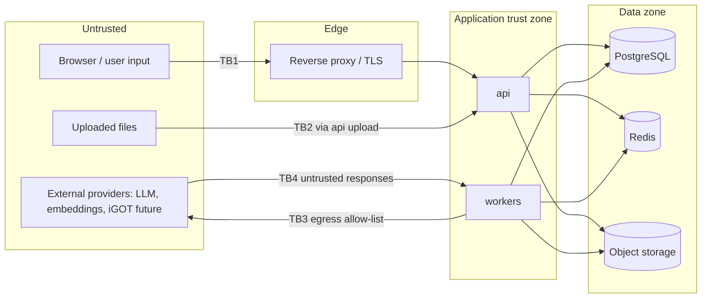

# Security and Responsible AI Specification

| Field | Value |
|---|---|
| **Version** | 1.0.0-draft |
| **Status** | Proposed - no security controls implemented in an application yet. **No certification, compliance or legal conformity is claimed.** |
| **Last updated** | 2026-09-14 |
| **Related** | [PRD.md](PRD.md) §15.1–15.2 · [AI_SYSTEM_SPEC.md](AI_SYSTEM_SPEC.md) · [API_INTEGRATION_SPEC.md](API_INTEGRATION_SPEC.md) · [DATA_MODEL.md](DATA_MODEL.md) · [DATA_PROVENANCE.md](DATA_PROVENANCE.md) · [OBSERVABILITY_SPEC.md](OBSERVABILITY_SPEC.md) · [ERROR_HANDLING_SPEC.md](ERROR_HANDLING_SPEC.md) · [TESTING_STRATEGY.md](TESTING_STRATEGY.md) |

## Table of contents

1. [Non-negotiable rules](#1-non-negotiable-rules)
2. [Threat model](#2-threat-model)
3. [Authentication](#3-authentication)
4. [Authorization, RBAC and permission matrix](#4-authorization-rbac-and-permission-matrix)
5. [Organization isolation and document ACLs](#5-organization-isolation-and-document-acls)
6. [Secure file upload (Upload)](#6-secure-file-upload-upload)
7. [Content sanitization](#7-content-sanitization)
8. [Prompt-injection defense](#8-prompt-injection-defense)
9. [SSRF prevention, rate limiting, input and output validation](#9-ssrf-prevention-rate-limiting-input-and-output-validation)
10. [Secrets management and encryption](#10-secrets-management-and-encryption)
11. [Audit logging](#11-audit-logging)
12. [Privacy, data minimization, retention and deletion](#12-privacy-data-minimization-retention-and-deletion)
13. [Backup, recovery and incident response](#13-backup-recovery-and-incident-response)
14. [Responsible AI governance](#14-responsible-ai-governance)
15. [High-impact decision restrictions (HID)](#15-high-impact-decision-restrictions-hid)
16. [Security and RAI verification checklist](#16-security-and-rai-verification-checklist)

---

## 1. Non-negotiable rules

These rules override any other document. Changing one requires an explicit governance decision recorded in [DECISIONS.md](DECISIONS.md).

| # | Rule | Enforced by |
|---|---|---|
| NR-01 | **AI must not make autonomous employment decisions** (appraisal, promotion, transfer, discipline, termination, selection, eligibility). | §15; PRD NG-1; no API or UI supports such use |
| NR-02 | **Competency scores must show evidence and limitations.** | AI-016, AI-017, AI-018; `UserCompetency.explanation` required |
| NR-03 | **AI-generated questions require validation** and human approval before any learner use. | MVP-15, MVP-16; invariant M-11 |
| NR-04 | **AI-generated content must be reviewable**: persisted with sources, model, prompt version and review status. | AI_SYSTEM_SPEC §41; RAI-014 |
| NR-05 | **Unsupported answers must be rejected or clearly marked.** In MVP they are rejected (abstention). | AI_SYSTEM_SPEC §17, §19; invariant M-09 |
| NR-06 | **External integration failures must not silently corrupt data.** | Adapter rules AD-4, AD-11; transactional sync; mock never persisted |
| NR-07 | **Sensitive data must not be sent to an AI provider without authorisation.** | AI_SYSTEM_SPEC §38; DEC-005 |
| NR-08 | **Authorisation is enforced server-side**; the frontend is never trusted. | §4 |
| NR-09 | **Secrets never appear in code, logs, API responses or client bundles.** | §10 |
| NR-10 | **Mock data is never represented as real.** | MOCK labels (M-13); `SourceRecord` rejects `MOCK` |
| NR-11 | **Licence-restricted content is not reproduced** (e.g. CSCD definitions). | `definitions_restricted`; validator LP-11 |

## 2. Threat model

### 2.1 Assets

| Asset | Sensitivity |
|---|---|
| Officials' account and profile data | Personal data |
| Competency estimates, evidence, attempts, answers | Personal data; high misuse potential |
| Correction request text | Personal data |
| AI interaction logs (redacted inputs/outputs) | Potentially personal |
| Question bank and answer keys | Integrity-critical (assessment validity) |
| Learning materials (including restricted-scope uploads) | Confidential / licence-restricted |
| Audit logs | Integrity-critical |
| Prompt templates and model configuration | Integrity-critical |
| Credentials and secrets | Critical |

### 2.2 Trust boundaries

### 2.3 STRIDE analysis

| ID | Threat | Category | Component | Mitigations | Residual risk |
|---|---|---|---|---|---|
| T-01 | Credential stuffing / brute force | Spoofing | Auth | Rate limiting, lockout, Argon2id, generic errors, MFA (P1) | Medium until MFA |
| T-02 | Session hijacking | Spoofing | Sessions | HttpOnly/Secure/SameSite cookies, rotation, idle/absolute timeout, revoke-all | Low |
| T-03 | CSRF on state-changing requests | Tampering | API | CSRF tokens, SameSite, no GET side effects | Low |
| T-04 | Horizontal privilege escalation (viewing another learner's profile) | Info disclosure | API | Policy checks per route, scoped queries, 404 for out-of-organisation, authz test matrix | Low |
| T-05 | Vertical escalation (self-granting roles) | Elevation | Users API | Only OA/PA assign roles; PA-only for `platform_admin`; cannot grant roles not held; audit | Low |
| T-06 | Cross-organisation data leakage | Info disclosure | Data layer | Mandatory `organization_id` filters; repository tests; RLS as defence in depth (DEC-024) | Low-medium before RLS |
| T-07 | Answer key exposure before submission | Info disclosure | Assessment API | Response models exclude keys; key-leak tests | Low |
| T-08 | Tampering with attempt results | Tampering | Assessment | Server-side scoring; attempt locking; audit on rescoring | Low |
| T-09 | Malicious file upload (malware, parser exploits, zip bombs) | Tampering / DoS | Upload, workers | Type/signature/size checks, macro rejection, decompression limits, worker resource limits, scan hook | Medium until real malware scanning |
| T-10 | Stored XSS via material metadata or AI output | Tampering | UI | Output encoding; no raw HTML rendering; sanitised markdown; CSP | Low |
| T-11 | Prompt injection through documents or questions | Tampering | AI | AI_SYSTEM_SPEC §36; no side-effecting tools; citation verification; injection suite | Medium (inherent to LLMs) |
| T-12 | Data exfiltration to AI provider | Info disclosure | AI adapters | Redaction; corpus restriction; provider approval (DEC-005); egress allow-list | Medium until DEC-005 |
| T-13 | Hallucinated content reaching learners | Integrity | AI | Grounding, verification, abstention, validators, human approval | Low for questions; low-medium for Q&A |
| T-14 | SSRF via user-supplied URLs | Info disclosure | Backend | No URL fetching from user input; collector allow-list only | Low |
| T-15 | Audit log tampering or deletion | Repudiation | Audit | Append-only grants/triggers; restricted access; hash chain (P1) | Medium until hash chain |
| T-16 | Denial of service / AI cost exhaustion | DoS | API, AI | Rate limits, quotas, job caps, timeouts | Medium |
| T-17 | Secret leakage via repository or logs | Info disclosure | All | `.env` git-ignored, secret scanning, log redaction | Low |
| T-18 | Misuse of competency data for employment decisions | Elevation (organisational) | Product | §15 restrictions, UI notices, report titles, no rankings, governance review | Medium (organisational control) |
| T-19 | Mock integration data mistaken for real | Integrity | Integrations, UI | MOCK labels, flags, health mode, never persisted | Low |
| T-20 | Re-identification from aggregates (P1) | Info disclosure | Analytics | Minimum group size suppression | Low (P1) |
| T-21 | Dependency supply-chain compromise | Tampering | Build | Pinned lock files, vulnerability scanning, admission rules | Medium |
| T-22 | Reviewer collusion or self-approval | Integrity | Review | Second-reviewer policy, self-approval block, audit | Low-medium |

| T-23 | Local development credentials leaked or reused | Info disclosure | Dev environment | `.env` git-ignored; generated random local password; database bound to `127.0.0.1:5433`; `DATABASE_URL` held as a secret and redacted in logs | Low |
| T-24 | Destructive tests run against a non-test database | Tampering | Test suite | Fixtures refuse databases whose name does not end in `_test`; separate `platform_test` database | Low |

The threat model is reviewed at every roadmap phase exit (SEC-021). New features add their threats here.

**Phase 2 review (2026-09-14):** T-23 and T-24 added. Controls now implemented: redacting JSON logs (T-17), problem responses without internal detail, security headers, append-only audit trigger (T-15, partial: no separate database role yet), MOCK rejection in reference tables (T-19). Authentication and authorisation threats (T-01 to T-06) remain open until Phase 3.

## 3. Authentication

| Control | Specification |
|---|---|
| Credentials | Email + password; minimum length 12 (provisional); breached-password check (Decision required whether an offline list is used); no composition rules beyond length |
| Hashing | Argon2id with tuned memory/time parameters recorded in configuration |
| Login errors | Generic "invalid credentials" message; same response time characteristics for unknown users |
| Lockout | After N consecutive failures (configurable, initial 5) lock for a period (initial 15 minutes); audit event; administrator unlock |
| Sessions | Server-side; 256-bit random token; stored hashed; HttpOnly, Secure, SameSite; idle timeout (initial 30 minutes) and absolute timeout (initial 12 hours); rotation on login and privilege change |
| CSRF | Double-submit token bound to session |
| Re-authentication | Required within last 10 minutes (provisional) for: role grants, framework approval, adjustments, prompt activation, security-relevant settings |
| Password change/reset | Change requires current password; administrator-initiated reset issues a one-time set-password token (expiry); all sessions revoked on change |
| MFA | P1 decision (TOTP proposed) for `org_admin`, `competency_admin`, `platform_admin`, `auditor` |
| SSO | P1 adapter ([API_INTEGRATION_SPEC.md](API_INTEGRATION_SPEC.md) §6) |

## 4. Authorization, RBAC and permission matrix

**Model:**
- Eight fixed access roles in MVP, assigned per user (`UserAccessRole`) and optionally scoped to a department.
- A user may hold several roles; permissions are the union, each evaluated within its own scope.
- Default deny.
- Policies are implemented in `identity/policy.py` and applied by route dependencies. Every endpoint in [API_INTEGRATION_SPEC.md](API_INTEGRATION_SPEC.md) §2 lists its roles.

**Scope definitions**
- **self:** Records belonging to the caller.
- **dept:** Users or resources within the caller's `department_scope_id` for that role.
- **assigned:** For trainers, learners in their department scope (MVP). Explicit trainer–learner assignment is P1.
- **org:** The caller's organisation.

**Permission matrix (MVP)** - ✓ allowed (org scope unless noted), ○ scoped as noted, - denied.

| Capability | learner | trainer | department_admin | org_admin | competency_admin | training_manager | auditor | platform_admin |
|---|---|---|---|---|---|---|---|---|
| View/edit own profile, select job role | ✓ self | ✓ self | ✓ self | ✓ self | ✓ self | ✓ self | ✓ self | ✓ self |
| Take assessments; view own results, profile, gaps, path, progress, recommendations | ✓ self | ✓ self | ✓ self | ✓ self | ✓ self | ✓ self | - | - |
| Submit correction requests (own) | ✓ self | ✓ self | ✓ self | ✓ self | ✓ self | ✓ self | - | - |
| Ask Document Q&A; search accessible materials | ✓ | ✓ | ✓ | ✓ | ✓ | ✓ | - | ✓ |
| Manage users (provision, deactivate) | - | - | ○ dept | ✓ | - | - | - | ✓ |
| Assign access roles | - | - | - | ✓ (not `platform_admin`) | - | - | - | ✓ |
| Manage departments | - | - | - | ✓ | - | - | - | ✓ |
| Manage job roles | - | - | - | ✓ | ✓ | - | - | - |
| Manage frameworks, competencies, levels; approve role mappings | - | - | - | read | ✓ | read | read | - |
| View other learners' profiles, gaps, attempts, progress | - | ○ assigned | ○ dept (progress, no answers) | - | ✓ (competency data) | ○ dept | - (audit logs only) | - |
| Adjust competency estimates | - | ○ assigned | - | - | ✓ | - | - | - |
| Decide correction requests | - | ○ assigned | - | - | ✓ | ✓ | - | - |
| Upload/manage learning materials | - | ✓ (own + org scope) | - | ✓ | ✓ | ✓ | - | - |
| Set licence flags (`generation_permitted`, `learner_display_permitted`) | - | - | - | ✓ | ✓ | ✓ | - | - |
| Manage courses and mappings | - | - | - | ✓ | ✓ (mappings) | ✓ | - | - |
| Generate questions; author questions | - | ✓ | - | - | ✓ | - | - | - |
| Review/approve/reject questions | - | ✓ | - | - | ✓ | - | - | - |
| Create/publish assessments | - | ✓ | - | - | ✓ | - | - | - |
| Generate reports | ✓ self | ○ assigned | ○ dept | ✓ | ✓ | ○ dept / org | - | - |
| Organisation settings and flags | - | - | - | ✓ (org keys) | - | - | read | ✓ |
| Prompt registry (register/activate) | - | - | - | - | - | - | read | ✓ |
| View audit logs | - | - | - | ○ org (limited) | - | - | ✓ | ✓ |
| View AI interaction logs | - | - | - | - | - | - | ✓ | ✓ |
| Integration health | - | - | - | ✓ | - | read | ✓ | ✓ |
| Job monitoring and retry | - | - | - | - | - | - | - | ✓ |

**Rules**
- **Separation of duties:** An `auditor` cannot modify data. A `platform_admin` does not see learner competency data by default (operations role). Access is granted separately only if justified and audited.
- **Self-action limits:** No user can adjust their own estimate or decide their own correction request.
- **Tests:** Every cell in this matrix is backed by automated authorisation tests (MVP-02).

## 5. Organization isolation and document ACLs

**Organisation isolation**
- Every tenant table carries `organization_id`.
- The repository layer requires an organisation context for every query and has no unscoped query helpers.
- Cross-organisation references are rejected by service validation and foreign key design.
- Row-level security is recommended before production as defence in depth (DEC-024).

**Document ACLs**

| `access_scope` | Who can read |
|---|---|
| `organization` | All users in the organisation |
| `department` | Users in `department_scope_id`, plus org-level administrators and the uploader |
| `restricted` | Uploader, `training_manager`, `org_admin`, `competency_admin` |

- **Where ACLs apply:** metadata listing, search, Q&A retrieval, generation source selection, page viewer, downloads and citation display.
- **Citation handling:** If a user loses access, citations to that document show "source no longer accessible" and do not reveal the quoted text.
- **Licence gate:** `learner_display_permitted=false` documents are visible only to staff roles and are excluded from learner-facing features (Q&A answers for learners, recommendations).

## 6. Secure file upload (Upload)

| Step | Control |
|---|---|
| Size | Reject above `MAX_UPLOAD_BYTES` before reading full body (streaming limit) |
| Type validation | Extension allow-list (`.pdf`, `.docx`, `.txt`); MIME detected from content (libmagic or equivalent) must match; PDF must start with `%PDF-`; DOCX must be a valid OOXML package without macros; TXT must decode as UTF-8 |
| Archive safety | DOCX decompressed size and entry count limits |
| Filename | Sanitised; never used as storage key; stored as metadata only |
| Storage | Opaque random keys; private buckets; no public URLs |
| Malware scanning | **Placeholder** hook in MVP records `malware_scan_status=not_scanned`; a real scanner is required before production (Decision required); documents with `infected` status are quarantined and never processed |
| Personal data screening | Pattern-based screen before embedding or any AI use; hits → `quarantined` + review task (`document_pii_quarantine`) |
| Attestation | Uploader confirms right to use and absence of personal data; stored with timestamp |
| Processing isolation | Workers with resource and time limits; parser failures fail safely |
| Serving | `X-Content-Type-Options: nosniff`; `Content-Disposition: attachment` for non-PDF; PDF rendered in sandboxed viewer |

## 7. Content sanitization

- **User-supplied text** (metadata, correction text, reasons) is stored as plain text and rendered with output encoding.
- **Markdown from AI output** is rendered through an allow-list sanitiser: no raw HTML, no images from remote URLs, and links shown as text or non-clickable unless the domain is allow-listed.
- **CSV exports** escape leading `=`, `+`, `-`, `@` characters (REP-012).
- **Content Security Policy:** `default-src 'self'`; no inline scripts; frame ancestors restricted.
- **Extracted document text** is untrusted: never interpreted as markup and never executed.

## 8. Prompt-injection defense

The full specification is in [AI_SYSTEM_SPEC.md](AI_SYSTEM_SPEC.md) §36. Security requirements:

1. **Data, not instructions:** Retrieved and uploaded content is delimited and labelled as untrusted data.
2. **No side effects:** No AI tool use or function calling with side effects in MVP.
3. **Output checks:** Outputs are validated (schemas, citation verification) before use.
4. **Detection:** Injection patterns at ingestion flag chunks; in questions they trigger abstention and a security log event (`ai.injection_suspected`).
5. **Test gate:** The injection test suite must pass before any prompt version is activated.
6. **No secrets in prompts:** Prompts contain no secrets. System prompt disclosure is not a security boundary, but it is still tested against.

## 9. SSRF prevention, rate limiting, input and output validation

**SSRF**
- **No user-supplied URLs:** The application never fetches URLs supplied by users (no URL upload, no link previews).
- **Adapter egress:** Outbound requests only from adapters to configured hosts (allow-list), with DNS rebinding protection (resolve once and connect to validated IPs, rejecting private and link-local ranges for any dynamically resolved host).
- **Collector:** The existing collector already enforces a host allow-list per manifest (`scripts/collectors/fetch_documents.py`).

**Rate limiting**
- **Limits:** Per [API_INTEGRATION_SPEC.md](API_INTEGRATION_SPEC.md) §1.10.
- **Failure mode:** If the limiter store is unavailable, fail closed for login and AI endpoints; fail open with logging for read endpoints (DEC-031).

**Input validation**
- **Schemas:** Pydantic request models (`extra="forbid"`) with length, range and enum constraints.
- **Server-side checks:** Uploads per §6. Identifiers are validated as UUIDs. Pagination limits are enforced.

**Output validation**
- **Response models:** Only declared fields are serialised (preventing accidental leakage, e.g. `is_correct`, `password_hash`).
- **AI outputs:** Validated per [AI_SYSTEM_SPEC.md](AI_SYSTEM_SPEC.md) §9–10, §17.

## 10. Secrets management and encryption

**Secrets management**

| Rule | Detail |
|---|---|
| Storage | Environment variables in local/CI; managed secret store in staging/pilot (per hosting decision) |
| Repository | `.env` and variants git-ignored (verified in `.gitignore`); `.env.example` contains placeholders only; secret scanning in CI and pre-commit |
| Logging | Redaction filters for known secret keys, `Authorization` headers, cookies, tokens |
| API | Settings API never returns secret values; secrets not stored in `Setting` |
| Rotation | Documented rotation procedure for `SESSION_SECRET`, database credentials and provider keys; rotation tested before pilot |
| Frontend | No secrets in the SPA bundle; build-time variables restricted to public configuration |

**Encryption**

| Layer | Control |
|---|---|
| In transit | TLS for all client traffic (HSTS); TLS to managed database, Redis and object storage where supported; TLS to AI providers |
| At rest | Database, backups and object storage encrypted by the hosting platform (verified in deployment checklist) |
| Application-level | Session tokens and IP addresses stored hashed; field-level encryption for especially sensitive fields is a P1 decision |

## 11. Audit logging

**Action catalogue (MVP).** Every entry records actor, roles, action, target, outcome, correlation ID, and redacted before/after where applicable.

| Domain | Actions |
|---|---|
| Authentication | `auth.login.success`, `auth.login.failure`, `auth.lockout`, `auth.logout`, `auth.password.change`, `auth.password.reset_issued`, `auth.reauthenticate`, `auth.sessions.revoke_all` |
| Users & roles | `user.create`, `user.update`, `user.status.change`, `user.access_role.grant`, `user.access_role.revoke`, `user.job_role.change` |
| Organisation | `department.create`, `department.update`, `department.deactivate`, `job_role.create`, `job_role.update`, `job_role.deactivate` |
| Competency | `framework.create`, `framework.approve`, `framework.retire`, `competency.create`, `competency.update`, `role_mapping.update`, `role_mapping.approve`, `competency.adjustment`, `evidence.void` |
| Data access | `profile.view_other`, `evidence.view_other`, `attempts.view_other`, `progress.view_other`, `document.download_restricted` |
| Assessment | `assessment.create`, `assessment.publish`, `assessment.retire`, `attempt.submit`, `attempt.rescore` |
| Questions & review | `question.create_manual`, `question.edit`, `question_generation.start`, `review.decision`, `review.override_validation`, `review.reassign`, `question.suspend` |
| Corrections | `correction.submit`, `correction.decide`, `correction.withdraw` |
| Content | `material.create`, `material.update`, `material.licence_flags.change`, `material.deactivate`, `document.upload`, `document.reprocess`, `document.quarantine`, `document.quarantine_release` |
| Catalogue | `course.create`, `course.update`, `course.review`, `course_mapping.approve` |
| Reports | `report.generate`, `report.download` |
| AI governance | `prompt.version.register`, `prompt.version.activate`, `ai.injection_suspected` |
| Platform | `setting.update`, `feature_flag.update`, `integration.mode.change`, `job.retry`, `seed.import`, `audit.view`, `ai_interactions.view` |

**Rules**
- **Fail closed:** Audit writes for these actions share the transaction with the action. If the audit write fails, the action fails.
- **Immutability:** Audit logs are immutable to application users (§DATA_MODEL AuditLog).
- **Contents:** Audit records contain no passwords, tokens, raw document text or free-text answers.
- **Retention:** Audit class (DEC-027).

## 12. Privacy, data minimization, retention and deletion

**Privacy considerations**
- **Personal data processed:**
  - account and profile data;
  - assessment answers, results and competency estimates;
  - correction requests;
  - learning activity;
  - AI interaction inputs, which may contain personal data despite redaction.
- **Lawful basis:** Processing officials' personal data requires a lawful basis and notices under applicable Indian law, including the Digital Personal Data Protection Act, 2023. **Legal review is required** before any pilot with real users (DEC-027). This document does not assert compliance.
- **Notice:** The privacy and AI-use notice is shown and acknowledged before any assessment (MVP-03). It explains the purpose, AI use, that estimates are development guidance only, who can see data, retention, and correction routes.
- **Purpose limitation:** Competency data is used only for learning and development purposes stated in the notice (§15).

**Data minimisation**
- Collect only profile fields needed for role-based learning: name, email, designation, department, job role, locale.
- No demographic or sensitive attributes are collected in MVP.
- Analytics events carry no content text ([PRD.md](PRD.md) §19).
- AI prompts carry no user profile data ([AI_SYSTEM_SPEC.md](AI_SYSTEM_SPEC.md) §38).
- Aggregates (P1) apply minimum group-size suppression.

**Data retention**
- **Classes and mechanisms:** [DATA_MODEL.md](DATA_MODEL.md) §17.
- **Periods:** Decision required; approved before pilot.
- **Enforcement:** Automated purge jobs (P1 feature SEC-018; a manual procedure is acceptable for pilot if documented).

**Data deletion**
- **MVP:** Account deactivation, with manual administrator-run deletion or pseudonymisation per an approved procedure.
- **P1 (SEC-019):** Self-service deletion requests. Propagation to chunks and embeddings of personally uploaded content, and pseudonymisation of records needed for audit integrity.
- **Uploaded documents:** Deactivation removes them from use immediately. Purge after a grace period unless cited by approved questions (in which case questions are suspended first).

## 13. Backup, recovery and incident response

**Backup and recovery**
- Automated encrypted database backups with point-in-time recovery (hosting dependent).
- Object storage versioning or backups.
- **RPO/RTO:** Decision required.
- **Restore procedure:** Documented and **tested before pilot** (SEC-020 is P1 as a feature; the restore test is a Phase 12 exit criterion).
- **Recoverability:** Embeddings and derived content are reproducible from documents; backups prioritise the database and documents.

**Incident response**

| Phase | Actions |
|---|---|
| Preparation | Named incident owner and contacts (Decision required); runbooks for credential leak, data exposure, AI misbehaviour, integration misrepresentation |
| Detection | Alerts ([OBSERVABILITY_SPEC.md](OBSERVABILITY_SPEC.md)): auth anomalies, authorisation failures spikes, audit write failures, injection events, AI refusal/abstention anomalies, budget overruns |
| Containment | Revoke sessions, rotate secrets, disable feature flags (e.g. `document_qa_enabled`, `question_generation_enabled`), suspend questions, quarantine documents |
| Eradication & recovery | Patch, restore, re-validate data integrity (audit and evidence consistency checks) |
| Notification | Legal and organisational notification obligations determined with legal review (DEC-027) |
| Post-incident | Blameless review; threat model and tests updated; decision log entry |

## 14. Responsible AI governance

| Topic | Specification |
|---|---|
| **Human review** | Mandatory approval for AI-generated questions (NR-03); reviewer sees source passage, validator flags and AI metadata; override requires reason; second-reviewer policy available ([AI_SYSTEM_SPEC.md](AI_SYSTEM_SPEC.md) §30) |
| **Explainability** | Competency estimates carry method, evidence, limitations and correction route (AI-018); recommendations carry reasons (RAI-011); Q&A answers carry verified citations and confidence band |
| **Bias monitoring** | MVP reviewer checklist and rule equality; P1 disparity analysis only with lawful basis ([AI_SYSTEM_SPEC.md](AI_SYSTEM_SPEC.md) §35); English-only limitation documented |
| **Model governance** | Provider approval (DEC-005); prompt and model registry with immutable versions; activation gated by evaluation; change log; periodic review of provider terms; fake providers in CI |
| **AI output correction** | Questions: edit → new version → re-validation → review; suspension on upheld disputes. Estimates: human adjustment with reason. Q&A: learner flag (P1); audit sampling (MVP) |
| **Appeal and review workflow** | Correction requests (RAI-018): learner submits on estimate, answer or question → review task to eligible reviewer (not the requester) → decision `upheld`/`not_upheld` with reason → learner sees outcome → upheld outcomes trigger adjustment, rescoring or question suspension with audit. SLA: Decision required; overdue requests escalate to `training_manager` (manual in MVP) |
| **Transparency** | AI-generated content is labelled "AI-generated"; mock data labelled "MOCK"; unreviewed data never learner-visible; model and prompt version visible to reviewers and auditors |
| **Evaluation** | No quality claims without `EvaluationRun`; golden datasets approved by SMEs; injection and redaction suites |
| **Accountability** | Product owner and AI governance owner named before pilot (Decision required) |

## 15. High-impact decision restrictions (HID)

The platform processes competency information about government officials. To prevent misuse:

1. **No employment decisions:** No feature computes, recommends or displays eligibility, ranking or suitability for appraisal, promotion, posting, transfer, deputation, discipline, termination or selection.
2. **No individual rankings:** No leaderboards of competency or assessment scores and no "top/bottom performers" lists. Trainer and manager views list learners unranked with support-oriented information only.
3. **Labelled reports:** Reports about individuals are titled "Learner development report" and carry the notice: *"This report supports learning and development. It is not an appraisal, performance evaluation or eligibility assessment and must not be used as one."*
4. **UI language:** Competency results use development-oriented wording ("developing", "strength", "reassess to confirm"), never evaluative labels about the person ("weak employee", "unfit", "failed").
5. **No data sharing with HR systems:** No export to appraisal systems (e.g. no SPARROW/APAR integration) and no API for bulk export of individual estimates.
6. **Aggregate analytics** (P1) suppress small groups and are designed for training planning only.
7. **Risky features gated:** Features with elevated misuse risk (role-readiness scores, weak-learner signals, leaderboards, predictive analytics) are excluded from MVP. They require a documented impact assessment and governance approval before any later phase (ROLE-008, TRN-011, GAM-008, AI-013, FUT-*).
8. **Handling misuse:** Detected misuse (e.g. requests to use reports for appraisal) is handled as an incident under §13 and recorded in [DECISIONS.md](DECISIONS.md).

## 16. Security and RAI verification checklist

Verified at Phase 12 (hardening) and before pilot:

- [ ] Authorisation test matrix passes for every endpoint × role (§4)
- [ ] Key-leak tests pass on all attempt endpoints (T-07)
- [ ] Cross-organisation isolation tests pass (T-06)
- [ ] Upload validation tests (spoofed type, macro DOCX, oversized, zip bomb) pass (§6)
- [ ] Secret scanning and dependency vulnerability scans pass in CI (§10)
- [ ] Audit catalogue events emitted and fail-closed behaviour verified (§11)
- [ ] Injection suite and redaction suite pass for every active prompt version (§8)
- [ ] Invariants M-09, M-11, M-12, M-13 verified in tests and audit sample
- [ ] Privacy notice approved; lawful basis and retention periods approved (DEC-027)
- [ ] AI provider approved with verified retention and region terms (DEC-005)
- [ ] Backup restore test completed; incident contacts named
- [ ] Malware scanning decision implemented or explicitly accepted as a documented pilot risk
- [ ] Threat model reviewed and residual risks accepted by the product owner
- [ ] External penetration test completed (required before production; recommended before pilot)
