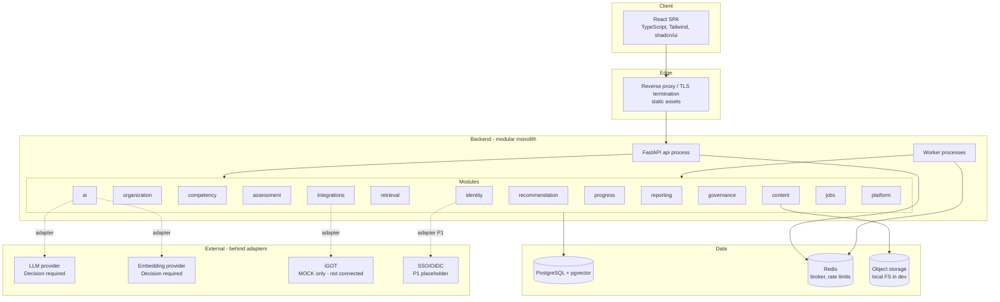
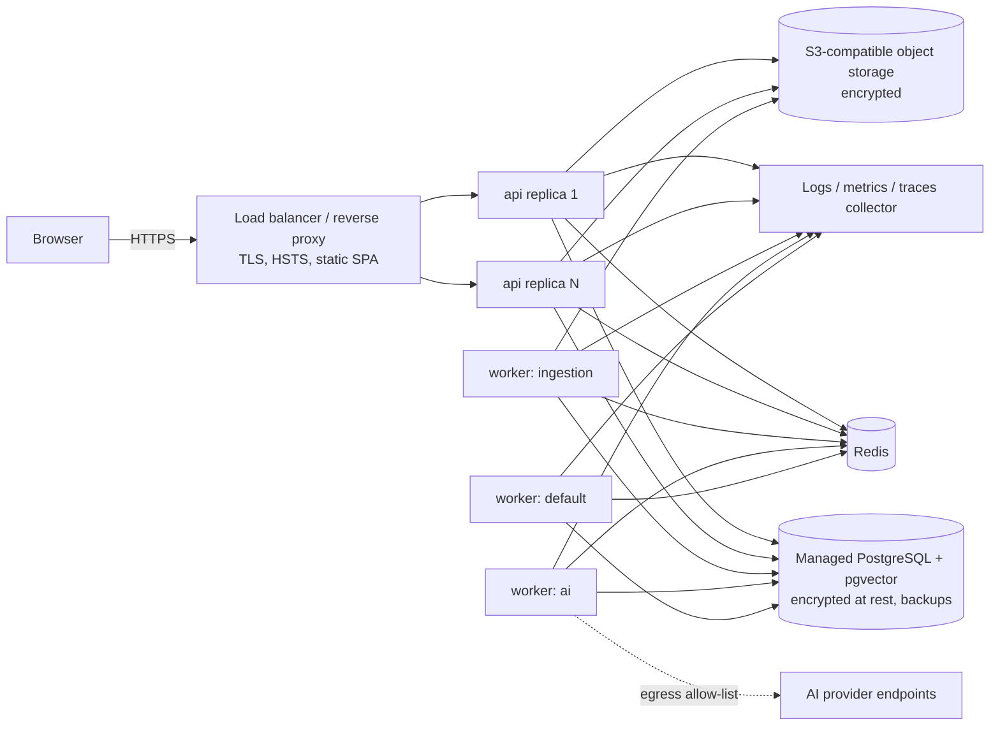
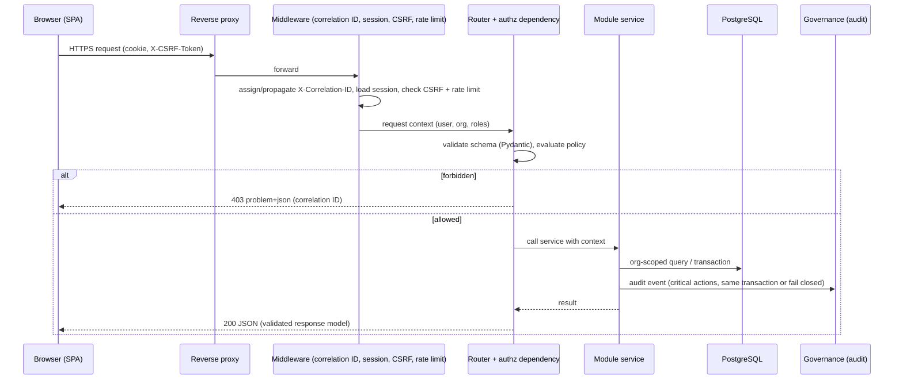
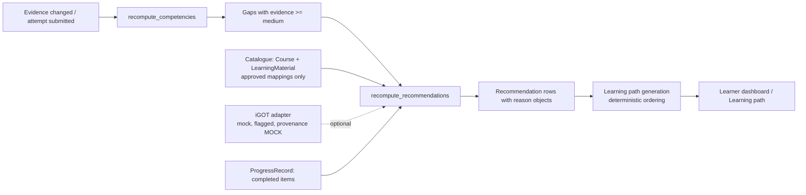
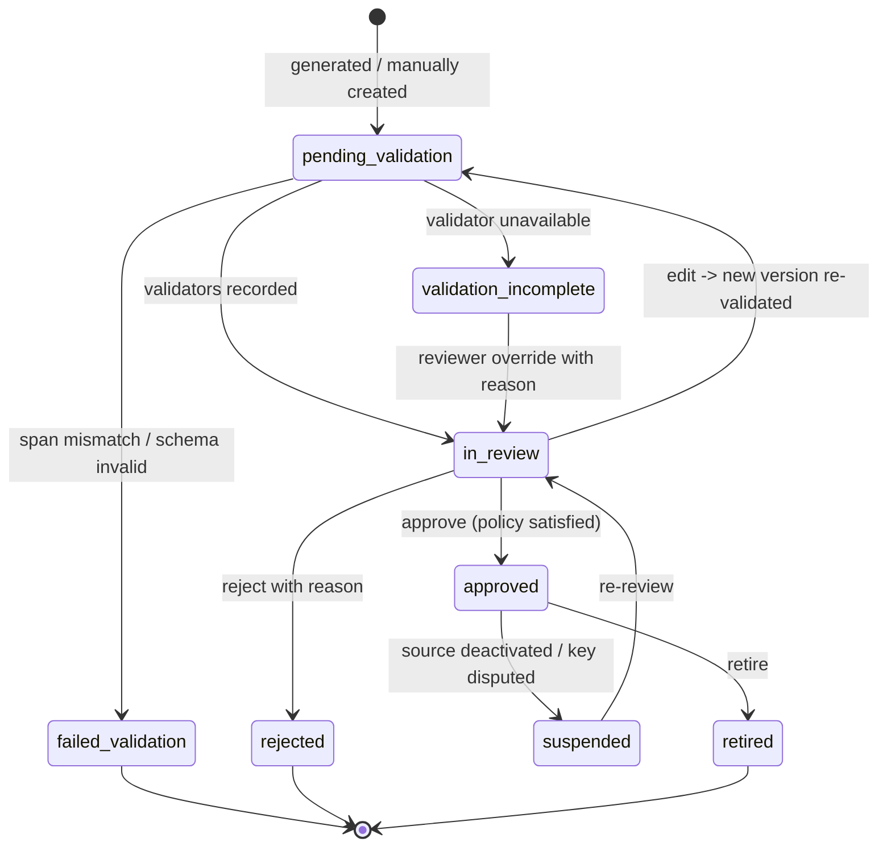
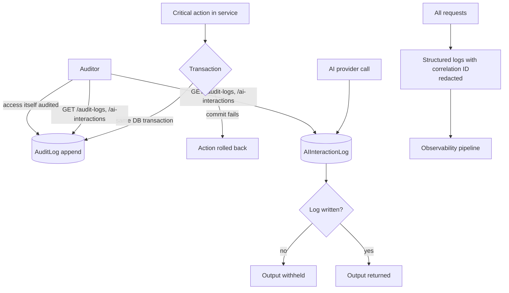
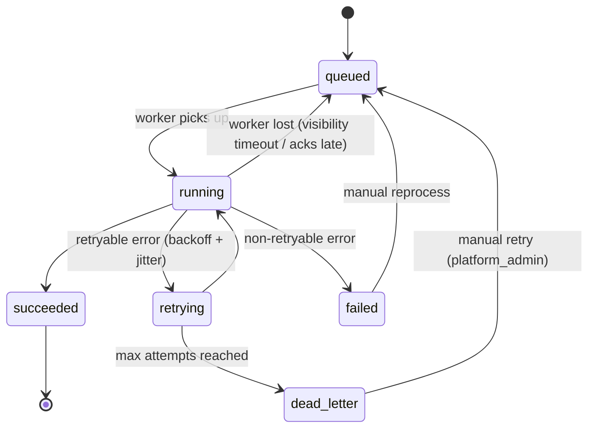
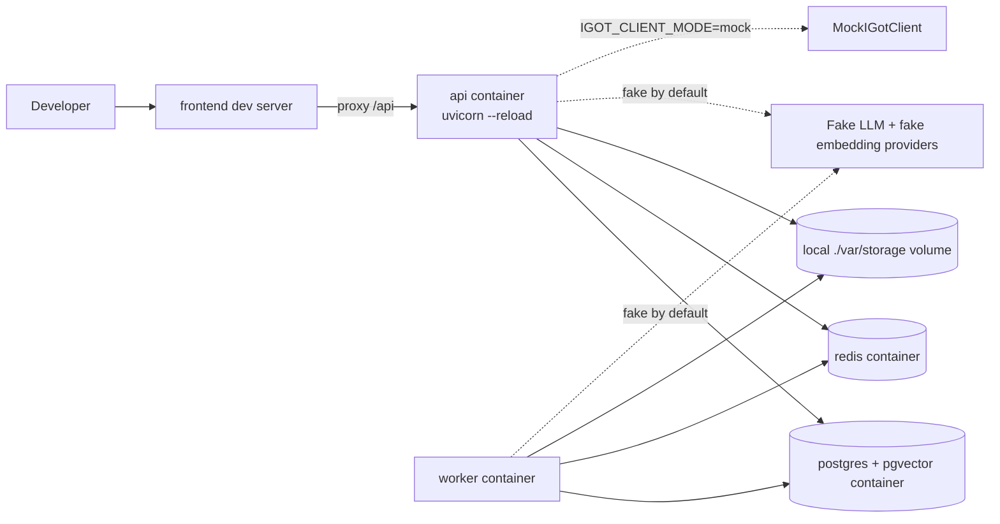

# System Architecture

| Field | Value |
|---|---|
| **Version** | 1.0.0-draft |
| **Status** | Proposed - not implemented |
| **Last updated** | 2026-09-14 |
| **Related** | [TECH_STACK.md](TECH_STACK.md) · [DATA_MODEL.md](DATA_MODEL.md) · [AI_SYSTEM_SPEC.md](AI_SYSTEM_SPEC.md) · [API_INTEGRATION_SPEC.md](API_INTEGRATION_SPEC.md) · [SECURITY_RESPONSIBLE_AI.md](SECURITY_RESPONSIBLE_AI.md) · [OBSERVABILITY_SPEC.md](OBSERVABILITY_SPEC.md) · [ERROR_HANDLING_SPEC.md](ERROR_HANDLING_SPEC.md) · [DECISIONS.md](DECISIONS.md) |

## Table of contents

1. [Current state (repository facts)](#1-current-state-repository-facts)
2. [Architectural drivers](#2-architectural-drivers)
3. [Architecture style](#3-architecture-style)
4. [Logical architecture](#4-logical-architecture)
5. [Service and module boundaries](#5-service-and-module-boundaries)
6. [Proposed repository layout](#6-proposed-repository-layout)
7. [Deployment architecture](#7-deployment-architecture)
8. [Request flow](#8-request-flow)
9. [Document-ingestion flow](#9-document-ingestion-flow)
10. [RAG flow](#10-rag-flow)
11. [Assessment flow](#11-assessment-flow)
12. [Recommendation flow](#12-recommendation-flow)
13. [Admin-review flow](#13-admin-review-flow)
14. [Audit flow](#14-audit-flow)
15. [Background-job flow](#15-background-job-flow)
16. [Failure recovery](#16-failure-recovery)
17. [Scaling strategy](#17-scaling-strategy)
18. [Observability](#18-observability)
19. [Configuration management](#19-configuration-management)
20. [Local development architecture](#20-local-development-architecture)
21. [Production evolution path](#21-production-evolution-path)
22. [Relationship to existing data tooling](#22-relationship-to-existing-data-tooling)

---

## 1. Current state (repository facts)

Verified on 2026-09-14:

| Area | What exists | What does not exist |
|---|---|---|
| Backend | — | No API service, no web framework, no ORM, no migrations |
| Frontend | — | No UI code, no `package.json` |
| Database | — | No PostgreSQL schema, no pgvector |
| Data tooling | Python 3.11 scripts: collection (`scripts/collectors/`), extraction (`scripts/utils/`), canonical build (`scripts/processing/`), validation (`scripts/validators/`); JSON Schema (`schemas/canonical_datasets.schema.json`) | No scheduler; no application ingestion pipeline |
| Integrations | `clients/igot_client.py` (interface, factory), `clients/mock_igot_client.py` (MOCK) | No real iGOT adapter; no SSO; no HTTP client code |
| AI | — | No LLM or embedding provider code; no prompts |
| Tests | 35 passing `unittest` tests (`tests/`) for canonical datasets and the mock iGOT client | No API, UI or AI tests |
| Dependencies | `pypdf` 6.18.1, `jsonschema` 4.26.0 (installed, no manifest) | No `requirements.txt` / `pyproject.toml` |
| Configuration | `.env.example` with `IGOT_CLIENT_MODE=mock` and commented placeholders | No settings module |
| Deployment | — | No containers, CI/CD, hosting |

**Update (2026-09-14, Phase 2):** `backend/` now exists with the FastAPI app factory, settings, JSON logging, problem responses, health endpoints, SQLAlchemy base, Alembic migrations `0001`-`0002` and a seed command; `deploy/docker-compose.yml` runs PostgreSQL 17 with pgvector locally. Current status and evidence: [IMPLEMENTATION_STATUS.md](IMPLEMENTATION_STATUS.md). The table above records the pre-implementation baseline.

Everything below this section is **proposed architecture** and requires approval.

## 2. Architectural drivers

| Driver | Architectural consequence |
|---|---|
| Human oversight of AI and evidence-based estimates | Review workflow and evidence ledger are first-class modules; AI outputs are persisted with metadata before display |
| Personal data of government officials | Organisation-scoped data layer, server-side authorisation, audit logging, provider data minimisation |
| No real external integration access | Adapter boundaries with explicit mock and not-connected modes |
| Small team, hackathon-to-pilot trajectory | Modular monolith, one database, minimal infrastructure |
| AI provider undecided and possibly constrained by data residency | Provider interfaces; AI modules independent of any SDK |
| Long-running document processing and generation | Background job system separate from request handling |
| Low-bandwidth users | Paginated APIs, lightweight SPA pages, server-side heavy lifting |

## 3. Architecture style

**Modular monolith** (DEC-002): one backend codebase deployed as two process types.

- **`api`**: FastAPI app serving `/api/v1`.
- **`worker`**: job workers running the same code.

Modules communicate through **in-process service interfaces**, never by importing another module's database models directly. This keeps a future extraction path open without paying microservice costs now.

Microservices are **not** justified by current repository evidence: no independent teams, no scale data, and one database. Extraction criteria are in §21.

## 4. Logical architecture



## 5. Service and module boundaries

| Module | Responsibility | Owns entities ([DATA_MODEL.md](DATA_MODEL.md)) | Depends on |
|---|---|---|---|
| `identity` | Authentication, sessions, access roles, permission policy | User, UserAccessRole, Session, NoticeAcknowledgement | platform, governance |
| `organization` | Organisations, departments, job roles | Organization, Department, JobRole | identity |
| `competency` | Frameworks, competencies, levels, role mappings, estimates, evidence, gaps, adjustments | CompetencyFramework, Competency, CompetencyLevel, RoleCompetency, UserCompetency, CompetencyEvidence | organization, assessment (read) |
| `assessment` | Question bank, versions, assessments, attempts, scoring | Question, QuestionVersion, QuestionOption, QuestionValidation, Assessment, AssessmentQuestion, AssessmentAttempt, AttemptQuestion, Answer | content (citations), governance |
| `content` | Learning materials, documents, pages, chunks, processing pipeline, storage | LearningMaterial, Document, DocumentPage, DocumentChunk, SourceRecord | jobs, ai (embeddings), platform |
| `retrieval` | Semantic and keyword search with ACL filters | Embedding (read/write via content), search read models | content, identity |
| `ai` | Provider adapters, prompt registry, RAG orchestration, generation, validation, citation verification, redaction, evaluation | PromptTemplate, PromptTemplateVersion, AIInteractionLog, EvaluationRun, Citation | retrieval, governance |
| `recommendation` | Courses catalogue, mappings, recommendations, learning paths | Course, CourseCompetency, CourseTopic, Recommendation, LearningPath, LearningPathItem | competency, content, integrations |
| `progress` | Learning activities and progress records | LearningActivity, ProgressRecord | recommendation, assessment |
| `reporting` | Report generation and exports | Report | competency, progress, assessment |
| `governance` | Audit logs, review tasks, approvals, correction requests | AuditLog, ReviewTask, Approval, CorrectionRequest | identity |
| `integrations` | External adapters (iGOT; future SSO, notification, course providers), health, sync logs | IntegrationConnection, IntegrationSyncJob | platform |
| `jobs` | Job enqueueing, status, retries, idempotency | BackgroundJob, IdempotencyKey | — |
| `platform` | Settings, feature flags, health, topics taxonomy, notifications (P1) | Setting, FeatureFlag, Topic, Notification (P1) | — |

**Boundary rules**
1. A module exposes a `service.py` interface. Other modules call that interface, never its `models.py` or `repository.py`.
2. Cross-module reads for dashboards and reports use **read-model queries** owned by the consuming module.
3. `ai` never imports provider SDKs outside `ai/providers/`.
4. `integrations` never imports vendor clients outside `integrations/<vendor>/`.
5. Authorisation policy lives in `identity/policy.py` and is invoked via FastAPI dependencies on every route.

## 6. Proposed repository layout

This is a proposal; the final layout is confirmed in Phase 2 (DEC-022). Existing directories are preserved.

```
KaramYogiAI/
├── backend/                     # NEW (Phase 2) - FastAPI modular monolith
│   ├── app/
│   │   ├── main.py              # app factory, routers, middleware
│   │   ├── core/                # settings, db session, logging, errors, security utils
│   │   ├── modules/
│   │   │   ├── identity/        # api.py, service.py, models.py, schemas.py, policy.py, repository.py
│   │   │   ├── organization/
│   │   │   ├── competency/
│   │   │   ├── assessment/
│   │   │   ├── content/
│   │   │   ├── retrieval/
│   │   │   ├── ai/              # providers/, prompts/, rag/, generation/, validation/, evaluation/
│   │   │   ├── recommendation/
│   │   │   ├── progress/
│   │   │   ├── reporting/
│   │   │   ├── governance/
│   │   │   ├── integrations/    # igot/ (interface + mock moved from clients/), sso/ (P1)
│   │   │   ├── jobs/
│   │   │   └── platform/
│   │   └── workers/             # worker entrypoints and task registration
│   ├── migrations/              # Alembic
│   ├── tests/                   # pytest: unit, integration, contract, authz, ai-eval
│   └── pyproject.toml
├── frontend/                    # NEW (Phase 8) - React + TypeScript SPA
├── clients/                     # EXISTING - iGOT interface + mock (to be moved into backend, DEC-021)
├── scripts/                     # EXISTING - data collection, processing, validation, docs tooling
├── data/                        # EXISTING - raw (git-ignored PDFs), interim, processed, samples/mock
├── schemas/                     # EXISTING - canonical dataset JSON Schema
├── registry/                    # EXISTING - source registry
├── tests/                       # EXISTING - dataset and mock client tests
├── docs/                        # EXISTING + this documentation package
└── deploy/                      # NEW (Phase 2/12) - compose files, container definitions
```

## 7. Deployment architecture

Hosting is **not decided** (DEC-009). The logical deployment below is provider-neutral.



| Environment | Purpose | Data |
|---|---|---|
| `local` | Developer machines (docker compose) | Public collected documents, synthetic users, MOCK iGOT |
| `ci` | Automated tests | Fixtures only; fake AI providers |
| `staging` | Pre-pilot integration | Synthetic users; public documents; real AI provider only after DEC-005 |
| `pilot` | Limited real users | Real accounts under approved lawful basis (DEC-027) |
| `production` | Future | Not planned until pilot evaluation |

Egress from workers to AI providers goes through an allow-list. No component makes requests to user-supplied URLs.

## 8. Request flow



## 9. Document-ingestion flow

```mermaid
sequenceDiagram
  participant T as Trainer
  participant API as api: content
  participant OBJ as Object storage
  participant DB as PostgreSQL
  participant Q as Job queue
  participant W as worker: ingestion
  participant E as Embedding adapter
  T->>API: POST learning-materials/{id}/documents (multipart, attestation, Idempotency-Key)
  API->>API: validate MIME, signature, size; SHA-256
  alt duplicate hash in org
    API-->>T: 200 duplicate_of
  else new
    API->>OBJ: store bytes (opaque key)
    API->>DB: Document(status=uploaded), BackgroundJob
    API->>Q: enqueue process_document(document_id)
    API-->>T: 202 job_id
  end
  Q->>W: process_document
  W->>W: malware-scan hook (placeholder, records "not scanned")
  W->>W: PII screen -> quarantine if detected
  W->>OBJ: read bytes
  W->>W: extract (pages) -> clean -> normalise -> chunk
  alt no text layer
    W->>DB: status=needs_ocr
  else text
    W->>DB: upsert pages, chunks (idempotent by document+chunker version)
    W->>E: embed chunks (batched)
    W->>DB: upsert embeddings (model, dim)
    W->>DB: status=ready
  end
  W->>DB: job completed / failed (attempts, error)
```

## 10. RAG flow

```mermaid
sequenceDiagram
  participant L as Learner
  participant API as api: ai.rag
  participant RED as Redaction
  participant RET as retrieval
  participant REG as Prompt registry
  participant LLM as LLM adapter
  participant CV as Citation verifier
  participant LOG as AIInteractionLog
  L->>API: POST /document-qa {question, scope}
  API->>RED: redact personal data in question
  API->>RET: search (ACL + org filter, semantic; keyword fallback)
  alt no chunk above threshold
    API->>LOG: record abstention
    API-->>L: abstained (reason: insufficient_evidence)
  else chunks
    API->>REG: load registered prompt version
    API->>LLM: generate (retrieved chunks as delimited untrusted data, chunk IDs)
    LLM-->>API: answer + cited chunk IDs/spans
    API->>CV: verify citations (in retrieved set, accessible, span match)
    alt no verified citation
      API->>LOG: record withheld answer
      API-->>L: abstained (reason: citation_verification_failed)
    else verified
      API->>LOG: record interaction (model, prompt version, chunks, citations, confidence)
      API-->>L: answer, citations, confidence, interaction_id
    end
  end
```

## 11. Assessment flow

```mermaid
sequenceDiagram
  participant L as Learner
  participant API as api: assessment
  participant DB as PostgreSQL
  participant J as Job queue
  participant C as competency worker
  L->>API: POST assessments/{id}/attempts
  API->>DB: create attempt with seed; snapshot approved question versions (no keys in response)
  API-->>L: attempt + questions (no answer keys)
  loop each answer
    L->>API: PUT attempts/{id}/answers/{qid}
    API->>DB: upsert answer (attempt open)
  end
  L->>API: POST attempts/{id}/submit
  API->>DB: lock attempt, score against delivered versions, write Answers.correct
  API->>DB: write CompetencyEvidence (append-only)
  API->>J: enqueue recompute_competencies(user), recompute_recommendations(user)
  API-->>L: result (feedback per policy)
  J->>C: recompute estimates (versioned method), bands, gaps
```

## 12. Recommendation flow



Ranking and path rules are in [AI_SYSTEM_SPEC.md](AI_SYSTEM_SPEC.md) §26–27. They are deterministic in MVP.

## 13. Admin-review flow



## 14. Audit flow



## 15. Background-job flow



Job types in MVP: `process_document`, `generate_questions`, `validate_questions`, `recompute_competencies`, `recompute_recommendations`, `generate_report`, `integration_health_check`, `retention_purge` (policy-dependent).

## 16. Failure recovery

| Failure | Detection | Behaviour | Recovery |
|---|---|---|---|
| API replica crash | Health checks | Load balancer removes replica | Restart; stateless API |
| Worker crash mid-job | Late acknowledgement / visibility timeout | Job re-queued | Idempotent handlers prevent duplicates |
| PostgreSQL unavailable | Readiness probe fails | API returns 503 problem; no partial writes | Managed failover (hosting-dependent); restore from backup |
| Redis unavailable | Health check | Job enqueue fails → 503 for job-creating requests; rate limiter fails closed for AI and login endpoints, open (logged) for reads | Restart; jobs recorded in DB can be re-enqueued |
| Object storage unavailable | Errors on read/write | Uploads fail with 503; processing jobs retry | Retry with backoff |
| LLM provider timeout/outage | Adapter errors | Retry within budget; then abstention/error state; generation job retrying → failed | Fallback model only if registered and evaluated ([AI_SYSTEM_SPEC.md](AI_SYSTEM_SPEC.md) §40) |
| Embedding provider outage | Adapter errors | Ingestion job retrying; search falls back to keyword mode | Re-run embedding step |
| Audit write failure | DB error in transaction | Critical action rolled back | Fix DB; user retries |
| iGOT adapter error | Adapter exception mapping | Source hidden; health `degraded`/`not_connected`; no data written | None needed for mock |
| Corrupted/invalid uploaded file | Validation / parser errors | `failed` with reason | Re-upload |

## 17. Scaling strategy

| Stage | Trigger | Action |
|---|---|---|
| Pilot | — | 1–2 api replicas, 1 worker per queue (ingestion, ai, default), single PostgreSQL instance with pgvector HNSW index |
| Growth | API p95 or CPU sustained above target (targets: Decision required) | Add api replicas (stateless) |
| Growth | Queue latency above target | Add workers per queue independently |
| Growth | Vector query latency above target | Tune HNSW parameters, partition embeddings by organisation, read replica for search |
| Growth | Report/analytics load affects OLTP | Read replica for reporting read models |
| Large | Evidence that PostgreSQL vector search is the bottleneck after tuning | Evaluate dedicated vector store (migration risk in [TECH_STACK.md](TECH_STACK.md)) |

AI cost scales with usage. Controls are per-user rate limits, per-organisation quotas and budget alerts ([AI_SYSTEM_SPEC.md](AI_SYSTEM_SPEC.md) §6).

## 18. Observability

Summary. The full specification is in [OBSERVABILITY_SPEC.md](OBSERVABILITY_SPEC.md).

- Structured JSON logs with `correlation_id`, `user_id` (pseudonymous), `org_id`, `module`, `event`, with redaction.
- Metrics: HTTP rate/latency/errors per route; job queue depth, duration and failures; AI tokens, latency, abstention rate, citation-verification failures and validation outcomes; integration health.
- Traces: OpenTelemetry spans across api → service → DB → provider adapters → workers (context propagated through job payloads).
- Health: `/healthz` (liveness), `/readyz` (DB, Redis, storage reachability).

## 19. Configuration management

| Class | Source | Examples | Rules |
|---|---|---|---|
| Secrets | Environment / secret store | `DATABASE_URL`, `REDIS_URL`, `SESSION_SECRET`, `LLM_API_KEY`, `EMBEDDING_API_KEY`, `STORAGE_*` credentials | Never in code, repo, logs or API responses; `.env` git-ignored |
| Static config | Environment with typed settings (Pydantic Settings) | `APP_ENV`, `LLM_PROVIDER`, `LLM_MODEL_GENERATION`, `EMBEDDING_MODEL`, `IGOT_CLIENT_MODE`, `MAX_UPLOAD_BYTES` | Validated at startup; invalid config aborts startup |
| Runtime settings | `Setting` table via admin API | Approval policy, evidence-band thresholds, minimum group size | Audited; versioned where they affect estimates |
| Feature flags | `FeatureFlag` table | `igot_mock_source_visible`, `document_qa_enabled`, `question_generation_enabled` | AI flags cannot be enabled without evaluation gate (RAI-012) |
| Prompts | Prompt registry tables, seeded from versioned files in `backend/app/modules/ai/prompts/` | `document_qa.v1`, `mcq_generation.v1`, `mcq_key_validation.v1` | Only registered versions usable |

Existing environment variables (from `.env.example`): `IGOT_CLIENT_MODE` (used, default `mock`), `IGOT_API_BASE_URL` and `IGOT_API_KEY` (commented placeholders; must remain unset until authorised access exists).

## 20. Local development architecture



- Default local AI providers are **deterministic fakes**, so tests and demos run without keys or data egress. Real providers are enabled only by explicit configuration after DEC-005 and DEC-006.
- Seed data: import from `data/processed/*.json`, synthetic users labelled as synthetic, and MOCK iGOT fixtures ([DATA_MODEL.md](DATA_MODEL.md) §Seed data).
- Raw PDFs are local-only (git-ignored). Ingestion tests that need them skip when files are absent.

## 21. Production evolution path

1. **Pilot:** Modular monolith; managed PostgreSQL/pgvector; Redis; object storage; approved AI provider; OIDC readiness.
2. **Hardening:** Penetration test; backup and restore drills; retention automation; tamper-evident audit chain; SSO (P1).
3. **Scale-out:** Read replicas; queue-specific worker pools; caching of read models.
4. **Selective extraction** (only if criteria are met): candidate modules are `content` ingestion workers and `ai` inference gateway. Criteria: independent scaling needs proven by metrics, a separate team ownership, or a different compliance boundary (e.g. a self-hosted model enclave). Extraction keeps the same service interfaces behind a network boundary.

## 22. Relationship to existing data tooling

| Existing asset | Role going forward |
|---|---|
| `scripts/collectors/fetch_documents.py` + manifests | Remains the controlled, manifest-based collector for official public documents; not exposed through the application |
| `scripts/utils/extract_pdf_metadata.py`, `parse_nssta_calendar.py`, `extract_cscd_structure.py` | Remain offline curation tools; the application pipeline reimplements extraction as tested services (may reuse logic) |
| `scripts/processing/build_canonical_datasets.py` + `schemas/canonical_datasets.schema.json` | Produces seed datasets; the application imports only datasets whose validation verdict is not INVALID |
| `scripts/validators/validate_canonical_datasets.py` | Gate before seed import (Phase 2 seed tooling calls it) |
| `clients/igot_client.py`, `clients/mock_igot_client.py` | Moved into `backend/app/modules/integrations/igot/` in Phase 10, preserving tests and behaviour (DEC-021) |
| `tests/` | Kept; run in CI alongside backend tests |
